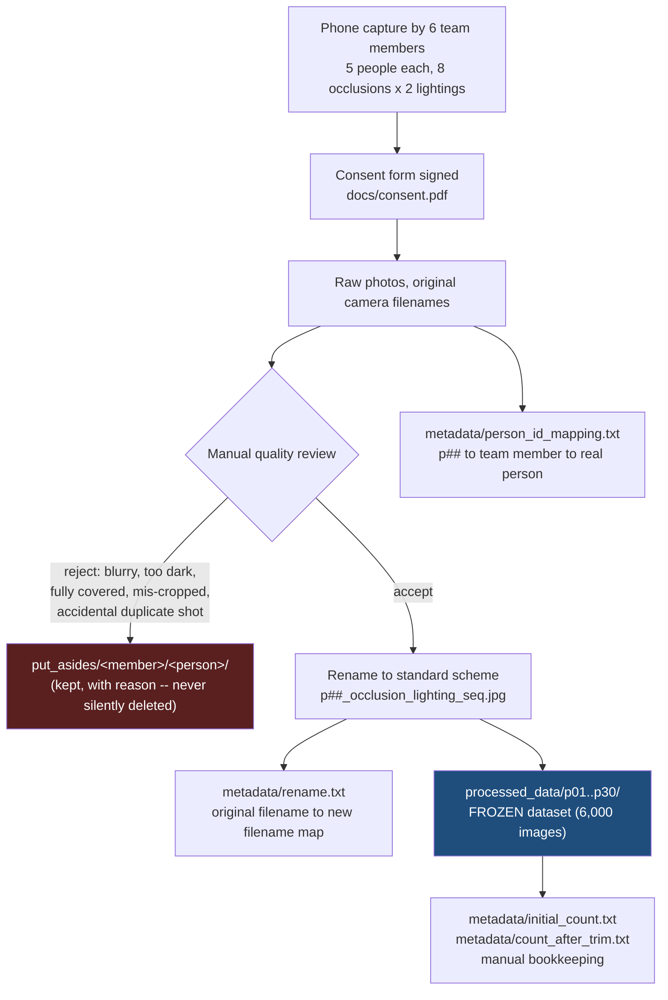
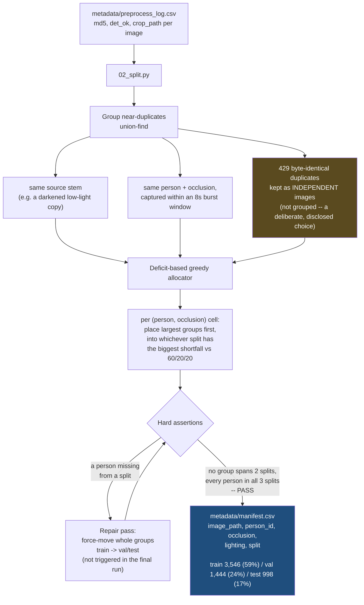
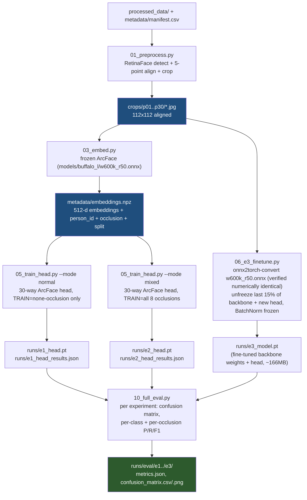
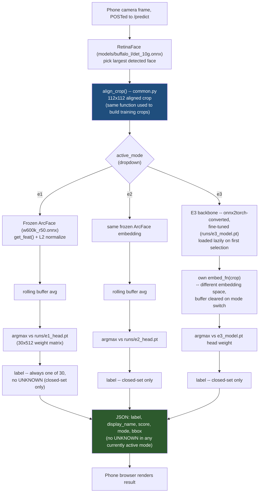

# Architecture

Four diagrams: manual data curation, the constrained train/val/test split,
the training pipeline for each experiment (E1-E3), and the inference
pipeline for each experiment as used by the live demo. File/folder names
match the actual repo layout (see `README.md`).

---

## 1. Data labeling, cleaning, adding, removing (manual)

Everything here is a human decision, made once, before any script runs.
Once `processed_data/` is accepted, it is treated as **frozen** -- no
further adding, removing, or relabeling.

**Notes:**
- 429 images turned out to be byte-identical duplicates (repeat shutter presses). These were **kept**, not merged or removed -- see diagram 2 for how splitting handles that honestly.
- `person_id_mapping.txt` and `rename.txt` are identity-linking metadata (real names, original filenames) -- kept out of git (see `.gitignore`), unlike everything downstream of them.

---

## 2. Data splitting strategy (constrained)

Runs once (`scripts/02_split.py`), after automated detection has produced
`preprocess_log.csv` (see diagram 3 for that step). Two hard constraints
drive the design: no near-duplicate leakage across splits, and every
identity present in all three splits.

**Note:** per-occlusion coverage inside each split is best-effort, not a hard assertion -- 36 of 240 `(person, occlusion)` cells are absent from the test split specifically; this is informational, reported in the final report, and not treated as a failure.

---

## 3. Training pipelines (E1-E3)

E1 and E2 share one automated preprocessing + embedding-extraction stage
and never touch raw pixels again after that. E3 is the exception -- it
needs raw pixels to backpropagate through the backbone, so it branches
off before embedding extraction.

---

## 4. Inference pipelines (E1-E3, as used by the live demo)

`scripts/09_server.py` loads E1/E2 at startup and E3 lazily (on first
selection), switching between them via a dropdown without restarting the
server. Detection and alignment are shared; only the embedding source
and the classifier differ per mode.

**Note:** switching modes clears the rolling embedding buffer, since E3's fine-tuned backbone produces a different (incompatible) embedding space from the one E1/E2 share.
