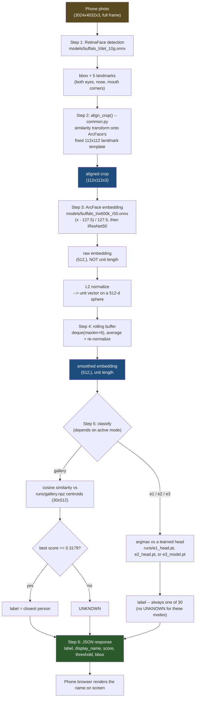
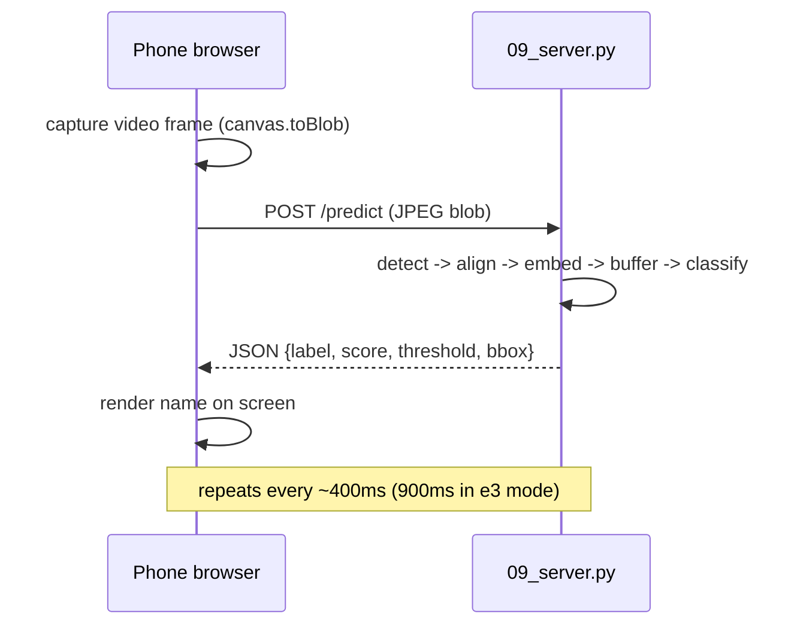

# Inference: from a face image to a label

Walkthrough of exactly what happens inside `scripts/09_server.py` between
a phone camera frame arriving and a name appearing on screen, using a
concrete running example: a photo of participant `p07`, wearing a mask.

See also: `docs/arch.md` §4 for the same pipeline drawn per experiment
mode; `docs/models.md` for what each model file is.

---

## Pipeline overview



---

## Step-by-step, with the worked example

### Step 0 -- input
A JPEG frame arrives as raw bytes at `/predict`. Decoded with OpenCV into a BGR array, e.g. `(3024, 4032, 3)` -- the face is just some region of a full-resolution phone photo.

### Step 1 -- face detection (RetinaFace, `det_10g.onnx`)
```python
faces = STATE["det"].get(img)
```
Returns, for every face found: a bounding box and **5 landmark points** (left eye, right eye, nose tip, left mouth corner, right mouth corner) as pixel coordinates in the original photo.

```
bbox  = [1120, 1429, 2376, 3031]
kps   = [[1520,1900], [2050,1910], [1780,2150], [1600,2650], [1980,2660]]
score = 0.94
```
A mask hides the mouth, but eyes and nose stay visible, so landmarks are still located reasonably well -- this is why `mask` is easier than `mask_sunglass`, which additionally hides the eyes.

If multiple faces are detected, `pick_best_face()` keeps the one with the largest bounding box.

### Step 2 -- alignment + crop (`align_crop()`, `common.py`)
```python
crop = align_crop(img, face.kps, image_size=112)
```
Computes a similarity transform (rotate + scale + translate, no distortion) mapping the 5 detected landmarks onto ArcFace's fixed reference positions on a 112x112 canvas, then warps and crops the original photo through it.

Effect: regardless of phone tilt, distance, or head turn, the eyes/nose/mouth always land in the same place in the output. This is the step that makes training and inference "see" the same kind of input -- and it's the exact same function used to build every training crop.

### Step 3 -- normalize + embed (ArcFace, `w600k_r50.onnx`)
```python
img = (crop_rgb.astype(float32) - 127.5) / 127.5   # pixels -> roughly [-1, 1]
feat = STATE["rec"].get_feat([crop])[0]              # shape: (512,)
feat = feat / (np.linalg.norm(feat) + 1e-9)          # force unit length
```
Output is a 512-number "fingerprint" -- not human-interpretable per-dimension, but geometrically: same-person faces land close together in this space, different people land far apart. The un-normalized magnitude varies per image (a real gotcha caught during development -- see `docs/final_report.tex` §9.3), so normalizing explicitly is mandatory before any similarity comparison.

### Step 4 -- temporal smoothing
```python
STATE["emb_buffer"].append(feat)             # deque(maxlen=6)
avg = np.mean(STATE["emb_buffer"], axis=0)
avg = avg / (np.linalg.norm(avg) + 1e-9)
```
Averages out per-frame noise (blur, blink, momentary bad angle) over roughly the last 2 seconds of frames (6 x ~400ms).

### Step 5 -- classify
**Gallery mode** (the deployed default, E0-style):
```python
sims = STATE["gallery"]["centroids"] @ avg   # (30, 512) @ (512,) -> (30,) cosine similarities
best = int(sims.argmax())
score = float(sims[best])
label = persons[best] if score >= 0.3179 else "UNKNOWN"
```
`centroids` is a `(30, 512)` matrix, one row per enrolled person -- each row is that person's *average* normalized embedding across the whole dataset. The dot product of two unit vectors is their cosine similarity: how close in angle `avg` is to each person's typical direction.

Example scores for the mask photo:
```
p07: 0.81   <- highest
p14: 0.22
p03: 0.19
...
```
0.81 >= 0.3179 -> **label = p07**.

**E1/E2/E3 modes** replace the centroid lookup with `argmax` against a learned `(30, 512)` weight matrix (`runs/e1_head.pt`, `e2_head.pt`, or `e3_model.pt`'s head) instead of real averaged embeddings -- fit by gradient descent, not averaging. No calibrated threshold exists for these, so they always return one of the 30 names. E3 additionally swaps step 3's model: the crop goes through E3's own fine-tuned backbone (a different embedding space) instead of the frozen `w600k_r50.onnx`.

### Step 6 -- response
```json
{
  "face_found": true,
  "mode": "gallery",
  "label": "p07",
  "display_name": "Tahmid/Rezwan",
  "score": 0.81,
  "threshold": 0.3179,
  "bbox": [1120, 1429, 2376, 3031]
}
```
The phone's browser reads this and renders `"Tahmid/Rezwan"` on screen in green.

---

## Request/response timing



---

**One-sentence summary:** pixels -> find the face -> warp it onto a fixed geometric template -> turn it into a 512-number fingerprint -> smooth that fingerprint over a few frames -> compare it to known fingerprints (or a learned decision boundary) -> threshold or argmax -> name.
