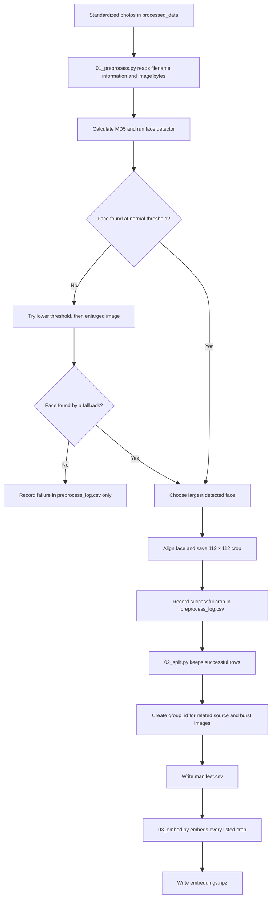
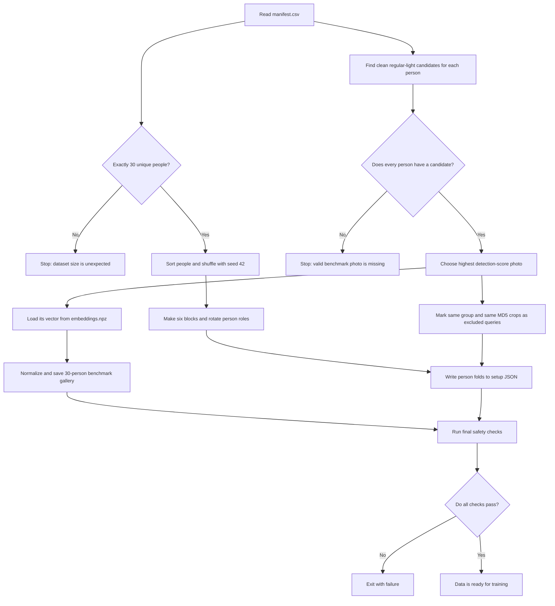
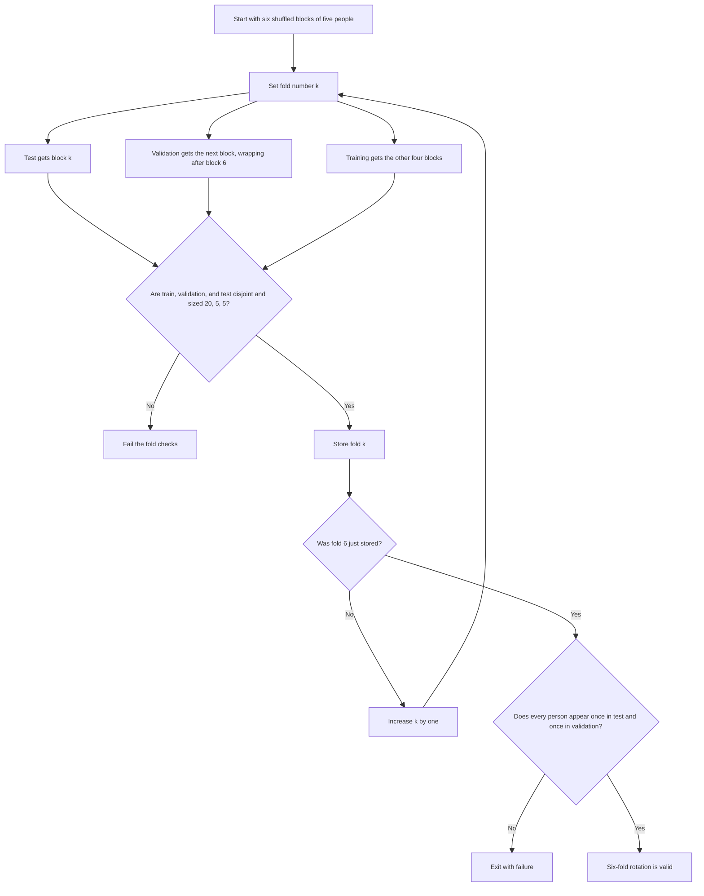

# Stage 1: Person-Based Data Split

This stage creates six fair train/validation/test folds and a fixed reference gallery for face matching. The main implementation is [`20_e1e2_person_folds.py`](../scripts/20_e1e2_person_folds.py).

## Purpose

The split is made by **person**, not by photo. A person assigned to training cannot also appear in validation or testing in the same fold. This prevents the model from being evaluated on another photo of someone it already saw during training.

There are 30 people. In each fold:

- 20 people are used for training.
- 5 different people are used for validation.
- 5 other people are used for testing.

Across all six folds, every person is used as a test person exactly once and as a validation person exactly once.

## Where `manifest.csv` comes from

The manifest is not created by `20_e1e2_person_folds.py`. It was created earlier by the dataset-preparation tools:

1. `01_preprocess.py` scanned the standardized photos under `processed_data/`. It read the person, occlusion, and lighting from each filename, calculated the image hash, detected the largest face, aligned it, saved a `112 x 112` crop, and wrote the result to `preprocess_log.csv`.
2. If the main detector attempt failed, `01_preprocess.py` tried a lower detection threshold and then an enlarged copy. Images that still failed were recorded in the preprocessing log but did not enter the manifest.
3. `02_split.py` read `preprocess_log.csv`, kept successful crops, created `group_id` values for related burst/source images, and wrote `manifest.csv`.
4. `03_embed.py` read the crops listed in the manifest and created `embeddings.npz`, which is needed when selecting the benchmark gallery.

Those dataset-preparation scripts were moved to `archive/scripts/` when the repository was pruned. Their location and restore instructions are recorded in [the repository archive notes](../../README.md#L49-L57). They are upstream data-building code, while [`20_e1e2_person_folds.py`](../scripts/20_e1e2_person_folds.py) is the current experiment-splitting code.

The old manifest generator also wrote an image-level `split` column. The current experiment never used it: current train/validation/test roles come from the person lists in `e1e2_person_folds.json`. That obsolete column and unused preprocessing-only columns have therefore been removed from the current manifest.

### Current manifest fields

| Field | Why it remains |
|---|---|
| `image_path` | Locates the original processed image for dataset reports and checks |
| `crop_path` | Locates the aligned face crop used for training and evaluation |
| `person_id` | Connects the row to a person and therefore to a fold role |
| `occlusion` | Supports clean-benchmark selection and results by occlusion |
| `lighting` | Restricts benchmark candidates to regular lighting |
| `md5` | Identifies exact duplicate images that must be excluded as queries |
| `group_id` | Identifies nearby/burst images that must be excluded together |
| `det_score` | Selects the strongest detected clean image as the benchmark |

The removed fields were `split`, `source_stem`, `det_ok`, `bbox_area_frac`, and `det_stage`. The original preprocessing log remains the appropriate place for those preprocessing details.

## Inputs and outputs

| Item | What it contains | Where it is handled |
|---|---|---|
| `manifest.csv` | One row per successful face crop, using the eight fields listed above | [Argument and manifest loading](../scripts/20_e1e2_person_folds.py#L36-L47) |
| `embeddings.npz` | A previously calculated embedding for every crop | [Embedding loading and lookup](../scripts/20_e1e2_person_folds.py#L71-L75) |
| `e1e2_person_folds.json` | The six person-based splits, benchmark-photo details, and excluded query photos | [Setup construction and save](../scripts/20_e1e2_person_folds.py#L86-L97) |
| `person_benchmarks.npz` | One normalized reference embedding for each of the 30 people | [Gallery save](../scripts/20_e1e2_person_folds.py#L83-L85) |

The paths can be changed with the command-line arguments defined in [the start of `main`](../scripts/20_e1e2_person_folds.py#L36-L42).

## Overall flow, including manifest creation

The full path is divided into smaller diagrams so labels remain readable.

### Upstream manifest and embedding creation

### Current person-fold and benchmark creation

## Step-by-step code map

### 1. Read the people in the dataset

The script reads every row from the manifest, collects the unique `person_id` values, sorts them, and requires exactly 30 people. See [manifest reading and the 30-person check](../scripts/20_e1e2_person_folds.py#L44-L47).

Sorting before shuffling makes the result repeatable even if the manifest rows are reordered.

### 2. Shuffle once and make six blocks

The random seed is fixed at `42`. The script shuffles the sorted person list once, then divides it into six blocks of five. See [seed and block settings](../scripts/20_e1e2_person_folds.py#L32-L33) and [block creation](../scripts/20_e1e2_person_folds.py#L49-L53).

Using a fixed seed means running the script again with the same people produces the same folds.

### 3. Rotate the train, validation, and test roles

For fold `k`:

- block `k` is the test group;
- the next block is the validation group;
- the remaining four blocks are the training group.

After the last block, "next" wraps around to the first block. This logic is in [fold construction](../scripts/20_e1e2_person_folds.py#L55-L60).

### 4. Choose one reference photo per person

For each person, the script keeps photos with:

- no occlusion; and
- regular lighting.

Among those photos, it chooses the one with the highest face-detection score. This becomes that person's fixed benchmark, or reference photo. See [benchmark-photo selection](../scripts/20_e1e2_person_folds.py#L64-L69).

This choice is made once and shared by all folds. The gallery therefore does not change from fold to fold.

### 5. Build the reference gallery

The selected photo's embedding is found in `embeddings.npz`. Each vector is normalized to length 1, and all 30 vectors are stacked into one gallery. See [embedding lookup and normalization](../scripts/20_e1e2_person_folds.py#L71-L75).

An **embedding** is a list of numbers that summarizes a face. Normalization makes later similarity comparisons consistent.

### 6. Prevent overly similar evaluation queries

For each person's benchmark photo, the script records all of that person's crops that:

- came from the same capture or burst group (`group_id`), or
- have identical image contents (`md5`).

These paths are stored in `excluded`. See [query exclusion construction](../scripts/20_e1e2_person_folds.py#L77-L81).

The training script later removes these paths from validation and test queries. This avoids an easy match caused by using the benchmark itself, a nearby burst frame, or a duplicate as an evaluation query.

### 7. Save both outputs

The normalized 30-person gallery is saved as a compressed NPZ file. The JSON setup stores the seed, gallery path, six folds, chosen benchmark details, and exclusions. See [output writing](../scripts/20_e1e2_person_folds.py#L83-L97).

## Safety checks and stopping behavior

This stage does not train a model, so it has no loss calculation, backpropagation, epochs, or early stopping. It performs hard data checks instead:

- every person must be a test person exactly once;
- every person must be a validation person exactly once;
- every fold must have separate 20/5/5 person groups; and
- no allowed query may share a capture group or identical file hash with its own benchmark.

These checks are in [the assertion section](../scripts/20_e1e2_person_folds.py#L99-L128). If any check fails, the script exits with an error instead of silently creating an unsafe split.

## Handoff to training

The training stage reads `e1e2_person_folds.json` to select one fold and reads `person_benchmarks.npz` both as the training target gallery and as the full 30-person evaluation gallery.
