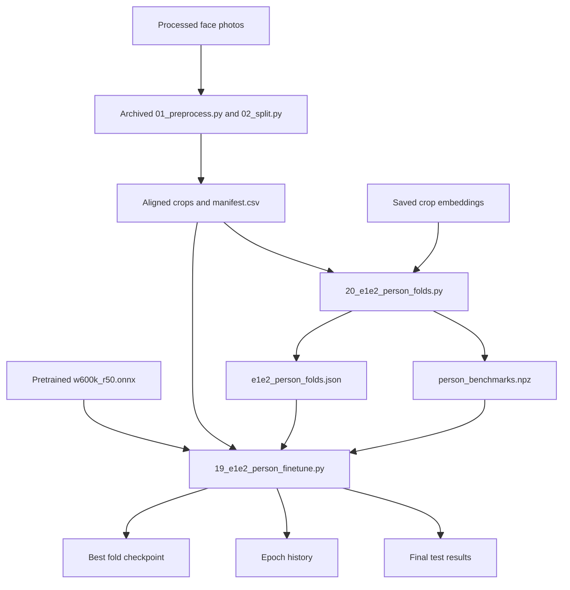
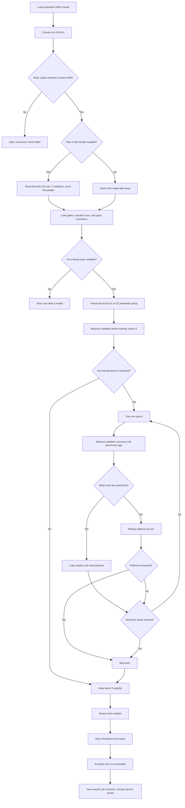
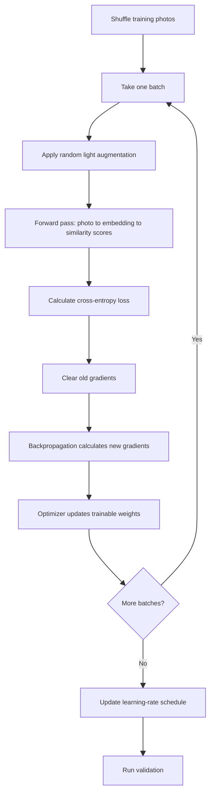

# Stage 2: Model Training

This stage fine-tunes selected parts of the ArcFace face-embedding model. The main implementation is [`19_e1e2_person_finetune.py`](../scripts/19_e1e2_person_finetune.py).

## Purpose

The model learns to move each training photo's embedding closer to the fixed benchmark embedding for the correct person. It does not learn a normal, permanent 30-class output layer. Instead, it learns a better face representation that can still be compared with people who were not used for training.

Two main fine-tuning choices are available:

| Experiment | What can change during training | Code |
|---|---|---|
| E1 | The last residual block | [E1 parameter prefixes](../scripts/19_e1e2_person_finetune.py#L65-L68) |
| E2 | The last residual block and the final embedding layers | [E2 parameter prefixes](../scripts/19_e1e2_person_finetune.py#L68-L70) |

E0 leaves everything frozen and is only a baseline. It should be run with `--epochs 0`, as noted by [the no-training branch](../scripts/19_e1e2_person_finetune.py#L287-L292).

## Where the training inputs come from

Training joins outputs from the earlier data stage with the pretrained recognition model:

- `manifest.csv` and the aligned crops were originally created by the archived `01_preprocess.py` and `02_split.py` dataset-preparation scripts, as described in [Stage 1](01_data_split.md#where-manifestcsv-comes-from).
- `e1e2_person_folds.json` and `person_benchmarks.npz` are created by [`20_e1e2_person_folds.py`](../scripts/20_e1e2_person_folds.py).
- `w600k_r50.onnx` is the pretrained ArcFace recognition model under `latest/models/`. It supplies the starting weights; this training script does not create it.
- `19_e1e2_person_finetune.py` combines those inputs and writes a checkpoint, history, and final test report for the selected experiment and fold.

## Overall training control flow

## Inputs and outputs

| Item | Use | Code |
|---|---|---|
| Pretrained `w600k_r50.onnx` | Starting face-recognition model | [Model path and conversion](../scripts/19_e1e2_person_finetune.py#L220-L236) |
| `e1e2_person_folds.json` | Chooses the 20 train, 5 validation, and 5 test people for `--fold` | [Fold selection](../scripts/19_e1e2_person_finetune.py#L238-L248) |
| `manifest.csv` | Supplies crop paths, person IDs, and test occlusion labels | [Manifest and row selection](../scripts/19_e1e2_person_finetune.py#L258-L279) |
| `person_benchmarks.npz` | Supplies the fixed reference embeddings | [Gallery loading](../scripts/19_e1e2_person_finetune.py#L250-L256) |
| `*_person_model.pt` | Best model weights and split/model details | [Checkpoint save](../scripts/19_e1e2_person_finetune.py#L369-L380) |
| `*_person_model_history.json` | Per-epoch training and validation history | [History save](../scripts/19_e1e2_person_finetune.py#L379-L380) |
| `*_person_results.json` | Final test results | [Result construction and save](../scripts/19_e1e2_person_finetune.py#L398-L437) |

The available command-line settings—including epochs, learning rate, batch size, margin, patience, and acceptance threshold—are defined in [the argument section](../scripts/19_e1e2_person_finetune.py#L182-L206).

## Preparation before training

### 1. Make the run repeatable and select the device

NumPy and PyTorch receive the chosen random seed. The script uses a CUDA GPU when available and otherwise uses the CPU. See [seed and device setup](../scripts/19_e1e2_person_finetune.py#L208-L218).

### 2. Convert and verify the pretrained model

The ONNX model is converted to PyTorch so selected weights can be updated. The same random test input is passed through both versions, and their outputs must have a mean cosine similarity of at least `0.999`. See [conversion verification](../scripts/19_e1e2_person_finetune.py#L220-L236).

If the converted model does not closely match the original, training stops immediately.

### 3. Load a fold without person leakage

With `--fold N`, the script gets that fold's train, validation, and test person lists. It also loads the exclusions created during the split stage. See [setup and fold loading](../scripts/19_e1e2_person_finetune.py#L238-L248).

Training rows include photos of the 20 training people. Validation and test rows include only their assigned people and remove the benchmark photo, same-burst photos, and exact duplicates. See [row filtering](../scripts/19_e1e2_person_finetune.py#L258-L265).

The validation and test people are not among the 20 people used to update the model.

### 4. Prepare photos and labels

Training images are loaded in their original crop form so a fresh random augmentation can be applied each epoch. Validation and test crops are preprocessed once. Labels are mapped either to the 20-person training head or the full 30-person gallery. See [image and label preparation](../scripts/19_e1e2_person_finetune.py#L271-L280).

Preprocessing changes BGR to RGB, scales pixel values to about `-1` through `1`, and changes the array layout expected by the model. See [`preprocess`](../scripts/19_e1e2_person_finetune.py#L95-L98).

## Model setup

The `EmbeddingModel`:

- keeps only the selected E1 or E2 parameters trainable;
- keeps the backbone in evaluation mode so Batch Normalization running values do not change;
- normalizes output embeddings;
- compares embeddings with the fixed training-person benchmarks; and
- applies the ArcFace angle margin to the correct person's score during training.

See [the model class](../scripts/19_e1e2_person_finetune.py#L147-L179).

The optimizer is AdamW, which updates the trainable weights and applies weight decay. A cosine schedule gradually changes the learning rate over the planned epochs. See [optimizer and scheduler creation](../scripts/19_e1e2_person_finetune.py#L282-L292).

## What happens in one training epoch

### Data augmentation

Each training photo can be randomly flipped, resized down and back up, blurred, given noise, JPEG-compressed, or have brightness/contrast changed. See [`light_augment`](../scripts/19_e1e2_person_finetune.py#L101-L125).

These variations help the model handle less-than-perfect camera images without changing validation or test photos.

### Forward pass and error calculation

For each batch, the model creates normalized embeddings and compares them with the 20 training people's benchmark vectors. The correct-person score receives an ArcFace margin. See [forward-score calculation](../scripts/19_e1e2_person_finetune.py#L166-L179) and [the batch forward pass](../scripts/19_e1e2_person_finetune.py#L333-L341).

The training error, called **loss**, is cross-entropy with `0.1` label smoothing. In simple terms, it becomes larger when the correct person does not receive a strong enough score compared with the other training people. Label smoothing discourages the model from becoming excessively certain. See [loss calculation](../scripts/19_e1e2_person_finetune.py#L340-L341).

The ArcFace margin is `0` during warm-up. It then rises gradually to the configured value, avoiding a sudden hard training target at the start. See [margin warm-up and ramp](../scripts/19_e1e2_person_finetune.py#L327-L331).

### Backpropagation and weight update

The core update is in [the gradient-update block](../scripts/19_e1e2_person_finetune.py#L342-L344):

1. Old gradients are cleared.
2. Backpropagation calculates how each trainable weight contributed to the loss.
3. AdamW changes only the unfrozen weights in the direction expected to reduce future loss.

The code accumulates average training loss and training accuracy for reporting, then advances the learning-rate schedule once per epoch. See [training measurements and scheduler step](../scripts/19_e1e2_person_finetune.py#L345-L348).

## Validation and model selection

Validation embeds each query and compares it with **all 30** benchmark vectors. The closest benchmark is the predicted person. See [`score`](../scripts/19_e1e2_person_finetune.py#L296-L314).

A result counts as correct only when:

1. the closest benchmark belongs to the true person; and
2. its cosine score is at least `--accept-threshold`.

The function also reports plain nearest-person accuracy without the threshold, correct matches rejected for low confidence, wrong matches accepted with enough confidence, and the benchmark gap. The gap is the correct person's score minus the strongest wrong person's score, defined in [`benchmark_gap`](../scripts/19_e1e2_person_finetune.py#L140-L144).

The model is measured before any update at epoch 0. This gives a fair pretrained baseline and allows it to remain the best model if fine-tuning makes validation worse. See [initial validation and first saved state](../scripts/19_e1e2_person_finetune.py#L316-L324).

## Stopping criteria

Training stops when either:

- it reaches `--epochs`; or
- validation has not improved for `--patience` consecutive epochs.

“Better” means higher accepted-correct validation accuracy. If accuracy ties, the higher mean benchmark gap wins. When a better epoch appears, its weights are copied and patience is reset. Otherwise patience drops by one. See [best-model comparison and early stopping](../scripts/19_e1e2_person_finetune.py#L350-L367).

After stopping, the script restores the best copied weights rather than keeping the final epoch. See [best-weight restoration](../scripts/19_e1e2_person_finetune.py#L369-L370).

## Final test

Only after model selection is finished does the script evaluate the five unseen test people against the full 30-person gallery. Test results do not choose an epoch or update any weight. See [final test evaluation](../scripts/19_e1e2_person_finetune.py#L383-L408).

The saved report includes:

- accepted-and-correct top-1 accuracy;
- a 95% Wilson confidence interval;
- plain nearest-person accuracy without rejection;
- correct-but-rejected and wrong-but-accepted rates;
- mean benchmark gap;
- accuracy by occlusion type; and
- accuracy for each test person.

The confidence-interval calculation is in [`wilson_ci`](../scripts/19_e1e2_person_finetune.py#L83-L92), while the per-occlusion and per-person breakdowns are in [the final reporting loops](../scripts/19_e1e2_person_finetune.py#L409-L432).

## Handoff to inference

The live demo loads the saved E1 or E2 checkpoint for a chosen fold. It uses the same preprocessing idea and the same fixed 30-person benchmark gallery (plus anyone registered through the demo page, whose benchmarks are built with E0), but it does not calculate loss or update weights.
