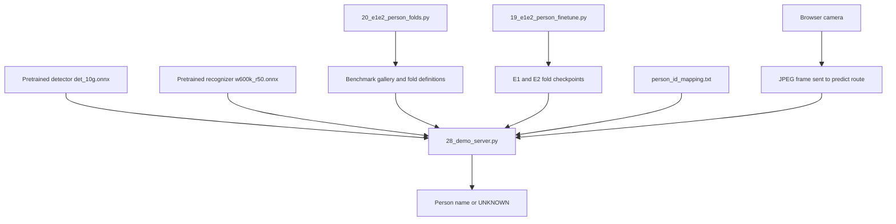
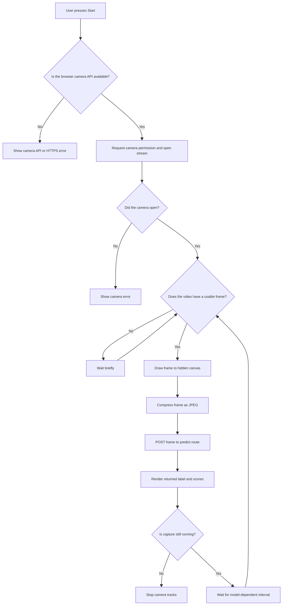
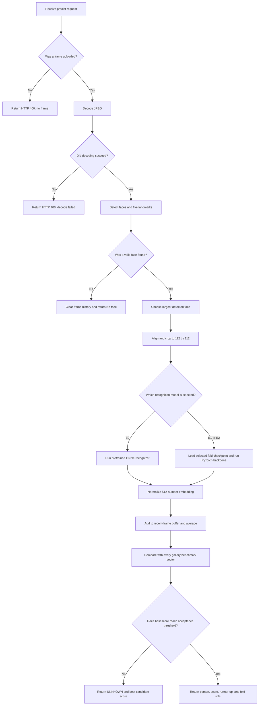
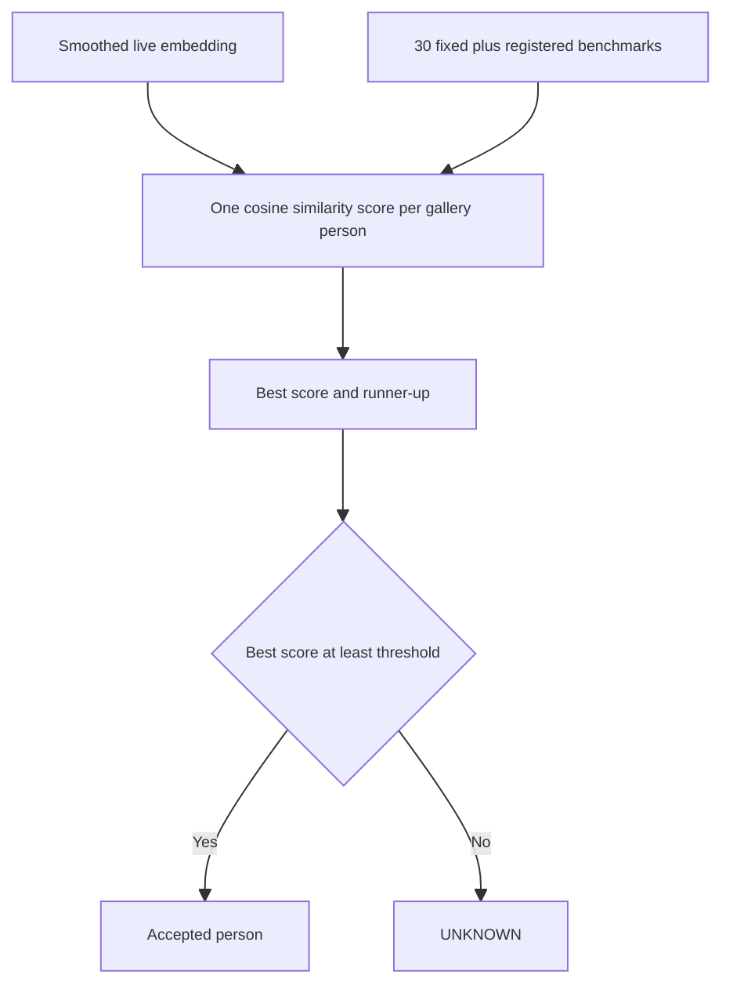
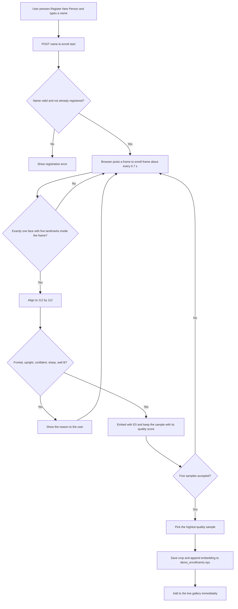
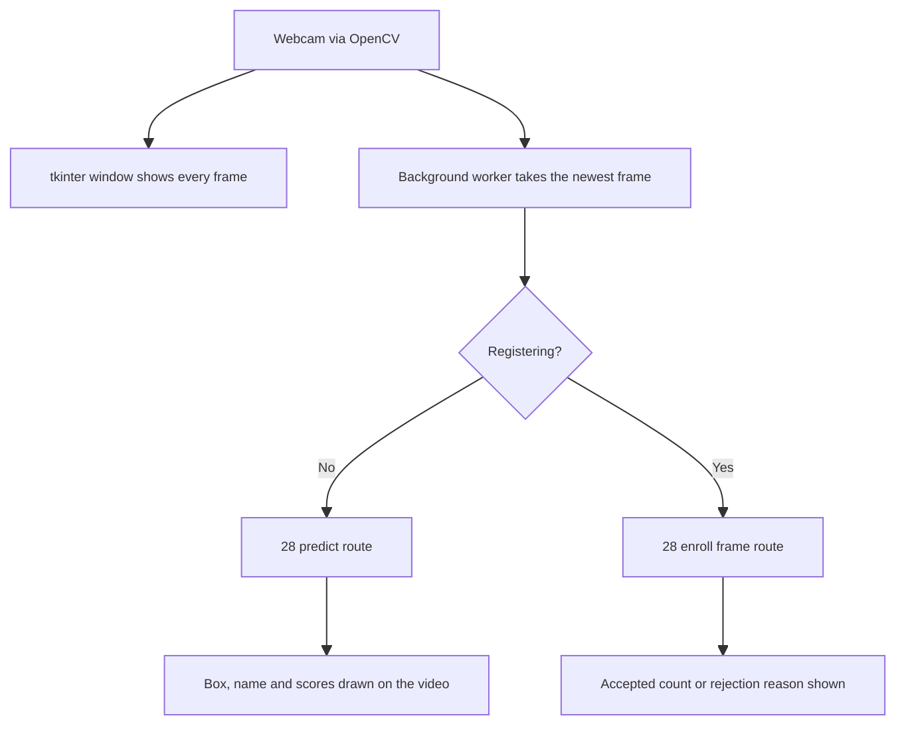

# Stage 3: Live Inference

This stage takes camera frames and returns a person name or `UNKNOWN`. The main server is [`28_demo_server.py`](../scripts/28_demo_server.py) (phone or browser camera); [`29_webcam_demo.py`](../scripts/29_webcam_demo.py) runs the same pipeline on this laptop's webcam (see [Webcam version](#webcam-version-on-this-laptop)). Both use the shared face-alignment function in [`common.py`](../scripts/common.py).

## Purpose

Inference means using an already trained model to make a prediction. There is no error/loss calculation, backpropagation, optimizer update, epoch, or early stopping in this stage.

The recognition method is a lookup:

1. turn the detected face into a 512-number embedding;
2. compare it with the saved benchmark embeddings (the fixed 30 people plus anyone registered in the demo);
3. take the most similar person; and
4. return that person only when the score reaches the acceptance threshold.

Otherwise, the result is `UNKNOWN`.

## Where the inference inputs come from

The demo combines saved outputs from the earlier stages with a live browser frame:

- `det_10g.onnx` and `w600k_r50.onnx` are pretrained model files stored under `latest/models/`. The demo loads them but does not create or train them.
- `person_benchmarks.npz` and `e1e2_person_folds.json` are created by [`20_e1e2_person_folds.py`](../scripts/20_e1e2_person_folds.py).
- The E1/E2 fold checkpoints are created by [`19_e1e2_person_finetune.py`](../scripts/19_e1e2_person_finetune.py).
- `person_id_mapping.txt` is project metadata that optionally maps IDs such as `p01` to display names.
- `demo_enrollments.npz` (optional) holds people registered through the demo page; see [Registering a new person](#registering-a-new-person).
- Camera frames come from the web page embedded in `28_demo_server.py`; the browser sends them to the same server's `/predict` route.



## Main inputs

| Input | Purpose | Code |
|---|---|---|
| `det_10g.onnx` | Detects faces and five face landmarks | [Detector loading](../scripts/28_demo_server.py#L93-L98) |
| `w600k_r50.onnx` | Produces E0 pretrained embeddings and is the base structure for E1/E2 | [Recognizer loading](../scripts/28_demo_server.py#L101-L106) |
| `person_benchmarks.npz` | Fixed 30-person reference gallery | [Gallery loading and normalization](../scripts/28_demo_server.py#L845-L848) |
| `e1e2_person_folds.json` | Describes who was train, validation, and test for each fold | [Fold loading](../scripts/28_demo_server.py#L863-L864) |
| E1/E2 `*_person_model.pt` files | Fine-tuned weights for a selected fold | [Checkpoint path and loading](../scripts/28_demo_server.py#L109-L132) |
| `person_id_mapping.txt` | Optional display names instead of `p##` IDs | [Name parsing](../scripts/28_demo_server.py#L316-L324) |
| `demo_enrollments.npz` | People registered in the demo, appended to the gallery at startup | [Enrollment loading](../scripts/28_demo_server.py#L211-L223) and [merge](../scripts/28_demo_server.py#L868-L878) |

The command-line options for paths, registration thresholds, acceptance threshold, detector settings, frame buffer, model, fold, and port are in [the server argument section](../scripts/28_demo_server.py#L794-L835).

## Browser capture and request loop



## Server prediction flow



## Server startup

### 1. Check and load required files

The server first requires the detector, recognizer, benchmark gallery, and folds file to exist. A missing required file stops startup with a clear message. See [required-file checks](../scripts/28_demo_server.py#L837-L843).

It normalizes the benchmark embeddings, loads person IDs and fold information, sets the acceptance threshold, and creates a rolling embedding buffer. See [state initialization from files and arguments](../scripts/28_demo_server.py#L845-L866).

### 2. Load the face models

The detector and pretrained E0 recognizer run with the CPU provider. See [model startup](../scripts/28_demo_server.py#L880-L882).

E1 and E2 are loaded when selected. The ONNX network is converted to a PyTorch backbone once, then the chosen experiment and fold weights are placed into that same backbone. See [`ensure_backbone`](../scripts/28_demo_server.py#L113-L132).

This avoids keeping a separate full model in memory for every fold.

### 3. Serve the camera page over HTTPS

The server creates or reuses a self-signed certificate, finds a likely LAN address, and starts an HTTPS web server. See [certificate creation](../scripts/28_demo_server.py#L327-L350) and [server startup](../scripts/28_demo_server.py#L895-L911).

HTTPS is needed because phone browsers normally allow camera access only from a secure page. The frames are posted to this local Flask server; this script does not send them to an outside recognition service.

## Browser-side frame loop

The page requests camera access, draws the current video image to a hidden canvas, compresses it as JPEG, and posts it to `/predict`. See [camera opening](../scripts/28_demo_server.py#L427-L458) and [the frame loop](../scripts/28_demo_server.py#L483-L498).

Frames are normally requested about every 500 ms. The interval becomes about 900 ms for the heavier E1/E2 path. The next request is scheduled only after the previous one finishes, which avoids a growing queue of old frames. See [model-dependent interval selection](../scripts/28_demo_server.py#L411-L425).

## Prediction steps on the server

### 1. Decode the frame

`/predict` reads the uploaded frame and decodes it as a color image. Missing or invalid data returns an HTTP error. See [request and decode checks](../scripts/28_demo_server.py#L759-L766).

### 2. Detect a face and choose one person

The detector returns face boxes and five landmarks. If several faces are present, the code chooses the face with the largest box. See [`pick_largest`](../scripts/28_demo_server.py#L308-L313) and [its use in prediction](../scripts/28_demo_server.py#L768-L773).

If no valid face and landmarks are found, recent embedding history is cleared and the browser receives `face_found: false`.

### 3. Align the face

The five landmarks—eyes, nose, and mouth corners—are used to rotate and position the face in a standard `112 x 112` crop. Prediction calls [the shared alignment function](../scripts/28_demo_server.py#L775), whose implementation is [`align_crop` in `common.py`](../scripts/common.py#L39-L48).

Using the shared function matters because inference should align a face the same way the dataset crops were aligned.

### 4. Create the embedding

E0 uses the pretrained ONNX recognizer. E1 and E2 use the selected fold checkpoint, including the same RGB conversion and pixel scaling used during training. Every output is normalized to length 1. See [`embed`](../scripts/28_demo_server.py#L135-L149).

When the user switches the model or fold, the server loads the requested checkpoint and clears recent embeddings because different models create different embedding spaces. See [`set_model`](../scripts/28_demo_server.py#L627-L651).

### 5. Smooth predictions over recent frames

The newest embedding is added to a rolling buffer, which holds six frames by default. The server averages the available embeddings and normalizes the average again. See [frame embedding and averaging](../scripts/28_demo_server.py#L775-L778) and [buffer configuration](../scripts/28_demo_server.py#L820).

This reduces flicker from small frame-to-frame changes. The buffer does not delay until all six positions are full; it uses however many recent frames are currently available.

### 6. Match against the gallery

Because both the live embedding and benchmark embeddings have length 1, their dot product is cosine similarity. The server calculates a score for every gallery person and chooses the largest. See [`classify`](../scripts/28_demo_server.py#L152-L160).



The default acceptance threshold is `0.3`. This is separate from the detector threshold: the detector threshold decides whether an area looks like a face, while the acceptance threshold decides whether the recognized face is similar enough to a known benchmark.

### 7. Return and display the result

The JSON response includes the result label, best person, best and runner-up scores, threshold, box, selected model/fold, and number of averaged frames. For E1/E2, it also explains whether the top person belonged to that fold's train, validation, or test group. See [prediction response](../scripts/28_demo_server.py#L780-L791) and [person-role lookup](../scripts/28_demo_server.py#L295-L305).

The browser displays either the accepted name or `UNKNOWN`, along with useful scores. See [browser result rendering](../scripts/28_demo_server.py#L590-L603).

## Registering a new person

The page's **Register New Person** button adds someone to the gallery without retraining anything. Registration is a separate path from `/predict`, and recognition itself is unchanged: a registered person is simply one more benchmark row.



### Quality gate

[`enrollment_quality`](../scripts/28_demo_server.py#L163-L208) accepts a frame only when all of the following hold:

| Check | Rule (default) | Option |
|---|---|---|
| One person | exactly one detected face | — |
| Five landmarks | all five points finite and inside the image, in a frontal arrangement: eyes left/right of the nose, nose between the eye line and the mouth line | — |
| Upright head | eye-line tilt ≤ 15° | `--enroll-max-tilt` |
| Detection confidence | detector score ≥ 0.65 | `--enroll-min-det-score` |
| Sharpness | Laplacian variance of the aligned crop ≥ 80 | `--enroll-min-blur` |
| Lighting | mean brightness of the aligned crop between 55 and 205 | `--enroll-min-light`, `--enroll-max-light` |

Each accepted frame receives a quality score: detector score, plus capped sharpness, plus how close brightness is to mid-grey, plus how upright the head is. After `--enroll-samples` frames (default 5) are accepted, the highest-scoring one becomes the benchmark. See [`/enroll/start`, `/enroll/cancel` and `/enroll/frame`](../scripts/28_demo_server.py#L654-L756) and the browser side in [registration loop](../scripts/28_demo_server.py#L499-L552).

### Why the new benchmark always uses E0

The fixed 30-person gallery was built by the pretrained E0 model. E1 and E2 are matched against that same E0 gallery. A registered person's benchmark is therefore always embedded with E0, whichever model is selected at the time, so the new row lives in the same space as the other 30 and works with E0, E1 and E2.

### Persistence

[`save_enrollment`](../scripts/28_demo_server.py#L239-L266) writes the chosen crop to `runs/e1e2/enrolled_people/enrolled_###.jpg`. It appends the embedding and name to `runs/e1e2/demo_enrollments.npz` by writing a temporary file and then replacing the old one. At startup, [`load_enrollments`](../scripts/28_demo_server.py#L211-L223) reads that file, and the rows are [appended to the fixed gallery](../scripts/28_demo_server.py#L868-L878). `person_benchmarks.npz` is never written, so the experiment's evaluation gallery stays exactly as reported. Registered names are always displayed, even without `--show-names`. To remove one person, use the People list (below); to remove everyone at once, delete both paths.

### Viewing and deleting people

Both demos can show the current gallery and delete people who were registered in the demo:

- **Phone page:** the **People** button toggles a list under the controls. The original 30 are listed as a read-only line, and each registered person has a **Delete** button.
- **Webcam window:** **People...** opens a second window with the same two lists and a **Delete selected** button.

Every delete asks for confirmation first.

The list comes from [`/people`](../scripts/28_demo_server.py#L677-L684), and deleting calls [`/enroll/delete`](../scripts/28_demo_server.py#L687-L696). The server accepts a delete only for an ID in the registered list, so the original 30 cannot be deleted even by a hand-made request. [`delete_enrollment`](../scripts/28_demo_server.py#L268-L288) does three things:
- it removes that person's row from the live gallery, so they stop being recognized immediately;
- it rewrites `demo_enrollments.npz` through the same atomic [`write_enrollments`](../scripts/28_demo_server.py#L226-L236) helper used by registration, removing the file once nobody is left;
- it deletes the person's saved crop.

A deletion is permanent and survives restarts. A later registration may reuse the freed `enrolled_###` ID.

## Webcam version on this laptop

[`29_webcam_demo.py`](../scripts/29_webcam_demo.py) runs the same demo on the laptop's own webcam in a desktop window, without a browser or HTTPS:

```bash
python latest/scripts/29_webcam_demo.py --show-names            # --camera 1 for the other camera
```

It contains no recognition logic of its own. It calls 28's [`build_parser` and `init_state`](../scripts/28_demo_server.py#L794-L888) to load the same models, gallery, folds and saved registrations. It then sends webcam frames to 28's `/predict`, `/set_model` and `/enroll/*` routes in-process through Flask's test client, so matching, the quality gate and saving are the exact same code. A person registered in one demo is recognized by the other.



The window has the same controls as the phone page: model and fold dropdowns, a name box with **Register New Person**, and **Cancel Registration**. Inference runs on one background thread, so the video stays smooth while a frame is being matched, and only that thread touches the models. The window uses tkinter rather than `cv2.imshow` because the installed OpenCV build has no GUI support. Every option of `28_demo_server.py` is accepted, plus `--camera`; `--port` is ignored.

## Important behavior and limits

- **One face per frame:** when several faces are visible, only the largest is recognized. Registration refuses frames that contain more than one face.
- **Known gallery only:** the system can name only the 30 people in the benchmark file plus anyone registered through the demo.
- **Threshold-based rejection:** a low score becomes `UNKNOWN`; the threshold is not learned by this script.
- **Short-term memory:** recent frames are averaged, then cleared when no face is found, the model changes, or a registration starts or finishes.
- **Fold meaning:** E1/E2 predictions use a particular fold checkpoint. Only that fold's five test people were unseen during its training. Registered people were never trained on by any fold.
- **No learning at runtime:** inference never changes model weights. Registration adds a benchmark row; it does not train anything.

## Connection to evaluation

Training evaluation and live inference use the same central decision rule: choose the most similar benchmark and accept it only at or above a threshold. For a direct comparison between offline results and the demo, start the training script and server with the same acceptance-threshold value.
