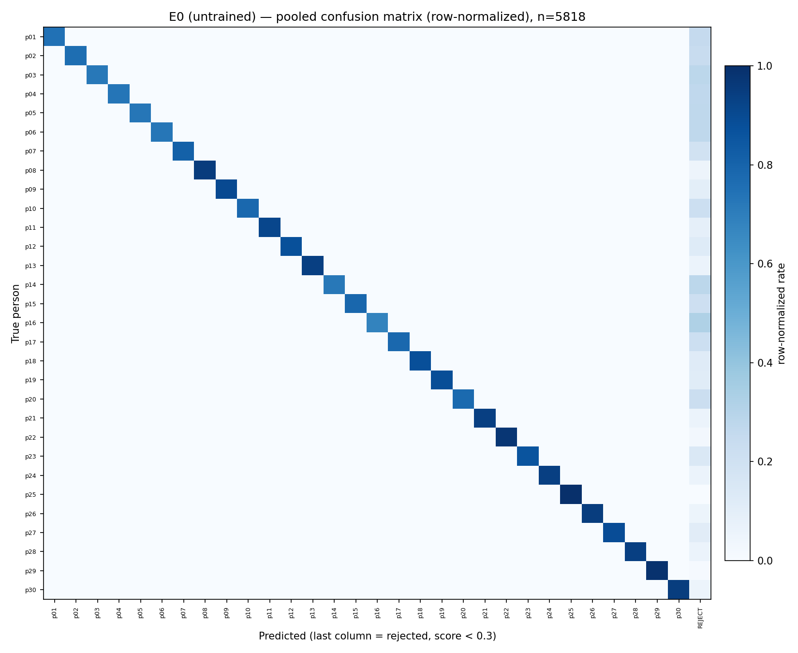
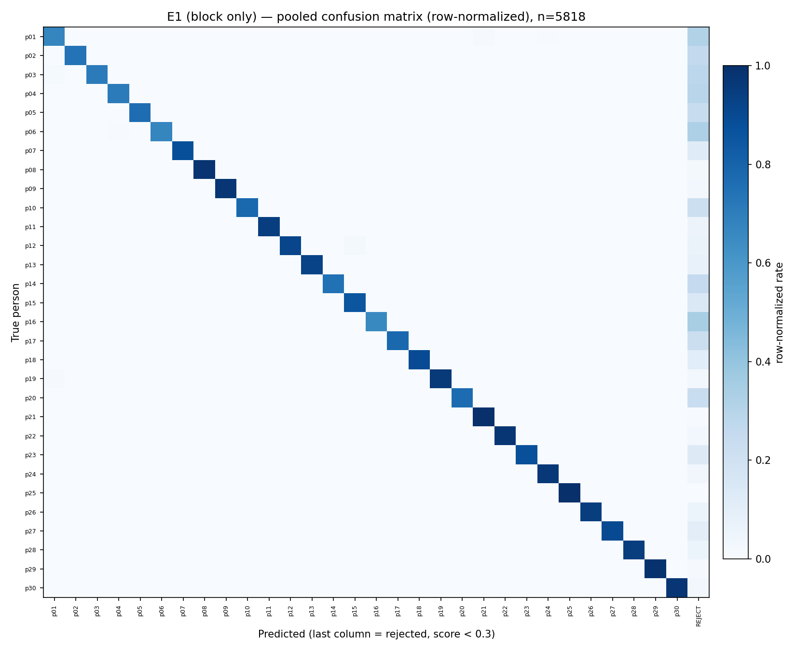

# Per-Person and Per-Occlusion Metrics (Confusion-Matrix Derived)

Companion to `report.md`. All numbers pooled over the 6 test folds (n=5,818 query photos, every one of the 30 people tested exactly once). A query is "correct" only if the predicted person is right AND the cosine score is ≥ 0.3; below that it is REJECTED and counts against recall for its true person but against no one's precision. Full 30×31 (person + REJECT) confusion matrices are in `runs/e1e2/analysis/{exp}_confusion_overall.csv` and `{exp}_confusion_<occlusion>.csv`; this file holds the metrics derived from them.

## 0. Confusion matrix heatmaps (row-normalized)

## 1. Overall accuracy and macro-averaged metrics

| Experiment | Accuracy | Macro precision | Macro recall | Macro F1 |
|---|---|---|---|---|
| E0 | 84.98% | 100.00% | 85.12% | 91.67% |
| E1 | 86.18% | 99.72% | 86.33% | 92.15% |
| E2 | 84.72% | 96.43% | 84.87% | 89.85% |

Macro precision is near 100% for all three because misidentification (a confidently wrong answer) is rare (E0: 0%, E1: 0.22%, E2: 3.32% — see `report.md` §4); most of the gap between accuracy and recall is REJECTED queries, not wrong-person queries.

## 2. Per-person precision, recall, F1 (support = query photos for that person)

### E0 (untrained)

| Person | Support | Precision | Recall | F1 |
|---|---|---|---|---|
| p01 | 198 | 100.0% | 74.7% | 85.5% |
| p02 | 199 | 100.0% | 75.9% | 86.3% |
| p03 | 198 | 100.0% | 72.2% | 83.9% |
| p04 | 197 | 100.0% | 73.1% | 84.5% |
| p05 | 199 | 100.0% | 72.9% | 84.3% |
| p06 | 194 | 100.0% | 72.7% | 84.2% |
| p07 | 196 | 100.0% | 81.1% | 89.6% |
| p08 | 191 | 100.0% | 95.3% | 97.6% |
| p09 | 194 | 100.0% | 90.2% | 94.9% |
| p10 | 194 | 100.0% | 78.4% | 87.9% |
| p11 | 197 | 100.0% | 91.4% | 95.5% |
| p12 | 198 | 100.0% | 87.9% | 93.5% |
| p13 | 199 | 100.0% | 94.0% | 96.9% |
| p14 | 190 | 100.0% | 72.1% | 83.8% |
| p15 | 199 | 100.0% | 78.9% | 88.2% |
| p16 | 198 | 100.0% | 67.7% | 80.7% |
| p17 | 199 | 100.0% | 78.4% | 87.9% |
| p18 | 194 | 100.0% | 88.1% | 93.7% |
| p19 | 199 | 100.0% | 88.4% | 93.9% |
| p20 | 199 | 100.0% | 77.4% | 87.3% |
| p21 | 185 | 100.0% | 94.1% | 96.9% |
| p22 | 189 | 100.0% | 97.4% | 98.7% |
| p23 | 192 | 100.0% | 85.9% | 92.4% |
| p24 | 187 | 100.0% | 94.1% | 97.0% |
| p25 | 191 | 100.0% | 100.0% | 100.0% |
| p26 | 194 | 100.0% | 94.8% | 97.4% |
| p27 | 187 | 100.0% | 88.8% | 94.1% |
| p28 | 187 | 100.0% | 94.1% | 97.0% |
| p29 | 185 | 100.0% | 98.9% | 99.5% |
| p30 | 189 | 100.0% | 94.7% | 97.3% |

### E1 (last residual block only)

| Person | Support | Precision | Recall | F1 |
|---|---|---|---|---|
| p01 | 198 | 96.4% | 67.2% | 79.2% |
| p02 | 199 | 100.0% | 73.9% | 85.0% |
| p03 | 198 | 100.0% | 70.7% | 82.8% |
| p04 | 197 | 99.3% | 71.1% | 82.8% |
| p05 | 199 | 100.0% | 76.4% | 86.6% |
| p06 | 194 | 100.0% | 67.0% | 80.2% |
| p07 | 196 | 100.0% | 88.3% | 93.8% |
| p08 | 191 | 100.0% | 98.4% | 99.2% |
| p09 | 194 | 100.0% | 97.4% | 98.7% |
| p10 | 194 | 100.0% | 78.4% | 87.9% |
| p11 | 197 | 100.0% | 94.4% | 97.1% |
| p12 | 198 | 100.0% | 91.4% | 95.5% |
| p13 | 199 | 100.0% | 92.5% | 96.1% |
| p14 | 190 | 100.0% | 74.7% | 85.5% |
| p15 | 199 | 97.7% | 85.4% | 91.2% |
| p16 | 198 | 100.0% | 65.7% | 79.3% |
| p17 | 199 | 100.0% | 77.9% | 87.6% |
| p18 | 194 | 100.0% | 89.2% | 94.3% |
| p19 | 199 | 100.0% | 96.5% | 98.2% |
| p20 | 199 | 100.0% | 76.9% | 86.9% |
| p21 | 185 | 98.9% | 99.5% | 99.2% |
| p22 | 189 | 100.0% | 97.4% | 98.7% |
| p23 | 192 | 100.0% | 87.5% | 93.3% |
| p24 | 187 | 99.5% | 96.8% | 98.1% |
| p25 | 191 | 100.0% | 100.0% | 100.0% |
| p26 | 194 | 100.0% | 94.8% | 97.4% |
| p27 | 187 | 100.0% | 89.8% | 94.6% |
| p28 | 187 | 100.0% | 94.7% | 97.3% |
| p29 | 185 | 100.0% | 98.9% | 99.5% |
| p30 | 189 | 100.0% | 97.4% | 98.7% |

### E2 (last residual block + fc)

| Person | Support | Precision | Recall | F1 |
|---|---|---|---|---|
| p01 | 198 | 100.0% | 59.6% | 74.7% |
| p02 | 199 | 99.3% | 75.9% | 86.0% |
| p03 | 198 | 88.3% | 72.2% | 79.4% |
| p04 | 197 | 68.3% | 63.5% | 65.8% |
| p05 | 199 | 100.0% | 72.9% | 84.3% |
| p06 | 194 | 100.0% | 75.8% | 86.2% |
| p07 | 196 | 99.4% | 90.3% | 94.7% |
| p08 | 191 | 100.0% | 95.3% | 97.6% |
| p09 | 194 | 100.0% | 95.9% | 97.9% |
| p10 | 194 | 97.4% | 78.4% | 86.9% |
| p11 | 197 | 99.5% | 93.4% | 96.3% |
| p12 | 198 | 97.7% | 84.8% | 90.8% |
| p13 | 199 | 100.0% | 94.0% | 96.9% |
| p14 | 190 | 88.4% | 72.1% | 79.4% |
| p15 | 199 | 87.2% | 85.9% | 86.6% |
| p16 | 198 | 100.0% | 60.1% | 75.1% |
| p17 | 199 | 92.9% | 78.4% | 85.0% |
| p18 | 194 | 99.4% | 88.1% | 93.4% |
| p19 | 199 | 94.6% | 88.4% | 91.4% |
| p20 | 199 | 100.0% | 74.4% | 85.3% |
| p21 | 185 | 98.9% | 98.9% | 98.9% |
| p22 | 189 | 99.5% | 97.4% | 98.4% |
| p23 | 192 | 99.5% | 94.3% | 96.8% |
| p24 | 187 | 100.0% | 96.8% | 98.4% |
| p25 | 191 | 99.0% | 100.0% | 99.5% |
| p26 | 194 | 100.0% | 94.8% | 97.4% |
| p27 | 187 | 100.0% | 77.0% | 87.0% |
| p28 | 187 | 97.2% | 94.1% | 95.7% |
| p29 | 185 | 100.0% | 98.9% | 99.5% |
| p30 | 189 | 86.5% | 94.7% | 90.4% |

## 3. Per-occlusion accuracy and macro-averaged metrics

Each occlusion's confusion matrix is computed only over that occlusion's query photos (same 30×31 person+REJECT structure), so precision/recall here are scoped to that condition, not the whole test set.

| Occlusion | n | E0 acc | E0 macroF1 | E1 acc | E1 macroF1 | E2 acc | E2 macroF1 |
|---|---|---|---|---|---|---|---|
| none | 667 | 100.0% | 100.0% | 99.4% | 99.7% | 99.6% | 99.6% |
| cap | 751 | 95.5% | 94.2% | 95.2% | 93.8% | 94.3% | 92.6% |
| clearglass | 667 | 100.0% | 96.7% | 99.0% | 96.0% | 98.7% | 95.4% |
| sunglass | 826 | 98.5% | 99.2% | 99.2% | 99.5% | 97.2% | 97.6% |
| scarf | 551 | 97.3% | 78.8% | 94.9% | 77.4% | 96.0% | 77.5% |
| mask | 853 | 90.2% | 93.4% | 89.9% | 92.9% | 88.0% | 90.8% |
| mask_clearglass | 726 | 68.5% | 75.8% | 68.9% | 76.3% | 66.7% | 71.1% |
| mask_sunglass | 777 | 35.6% | 45.9% | 47.2% | 55.4% | 42.7% | 50.1% |

### Per-occlusion macro precision / recall

| Occlusion | E0 P / R | E1 P / R | E2 P / R |
|---|---|---|---|
| none | 100.0% / 100.0% | 100.0% / 99.5% | 99.7% / 99.6% |
| cap | 96.7% / 92.5% | 96.1% / 92.1% | 95.0% / 91.3% |
| clearglass | 96.7% / 96.7% | 96.4% / 95.7% | 95.5% / 95.5% |
| sunglass | 100.0% / 98.5% | 100.0% / 99.1% | 99.0% / 96.7% |
| scarf | 80.0% / 77.7% | 80.0% / 76.0% | 78.6% / 77.0% |
| mask | 100.0% / 89.3% | 99.6% / 89.1% | 98.0% / 87.3% |
| mask_clearglass | 96.7% / 67.4% | 96.7% / 68.1% | 85.4% / 65.7% |
| mask_sunglass | 80.0% / 36.7% | 81.3% / 47.1% | 70.3% / 42.7% |

## 4. Files

| Path | Contents |
|---|---|
| `runs/e1e2/analysis/{exp}_metrics.json` | This file's source numbers, machine-readable |
| `runs/e1e2/analysis/{exp}_confusion_overall.csv` | 30×31 confusion matrix (true person × predicted person + REJECT), pooled over all 6 folds |
| `runs/e1e2/analysis/{exp}_confusion_<occlusion>.csv` | Same, restricted to that occlusion's query photos |

Produced by `scripts/21_e1e2_confusion.py --exp {e0,e1,e2}` (reads the checkpoints already saved by `19_e1e2_person_finetune.py`; does not retrain anything).
