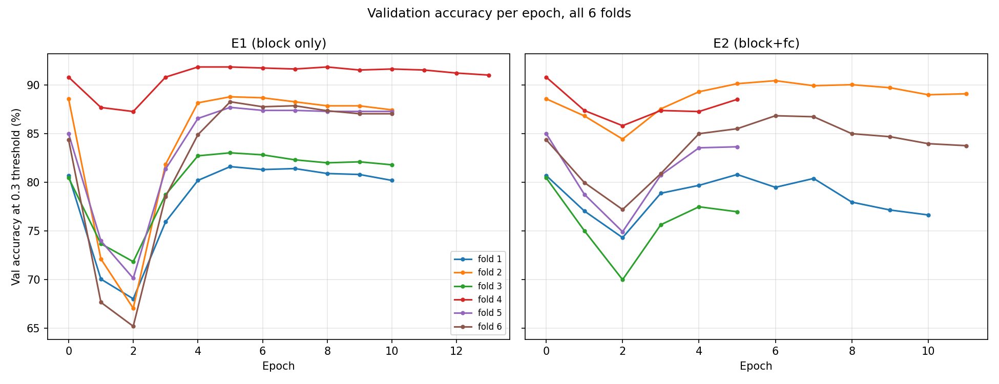

# Epoch-Wise Training Curves

Companion to `report.md`. Per-epoch validation accuracy (accepted-and-correct at the 0.3 threshold) and mean benchmark gap, for every fold and experiment. Epoch 0 is always the untrained backbone (identical across E0/E1/E2 within a fold, since none have trained yet). **Bold** marks the epoch actually kept (the training run's `best_epoch`).

## E0 (untrained)

### Fold 1 (best epoch: 0)

| Epoch | Margin | Train loss | Train acc | Val acc | Val gap |
|---|---|---|---|---|---|
| **0** | 0.000 | — | — | **80.71%** | 0.3250 |

### Fold 2 (best epoch: 0)

| Epoch | Margin | Train loss | Train acc | Val acc | Val gap |
|---|---|---|---|---|---|
| **0** | 0.000 | — | — | **88.60%** | 0.3393 |

### Fold 3 (best epoch: 0)

| Epoch | Margin | Train loss | Train acc | Val acc | Val gap |
|---|---|---|---|---|---|
| **0** | 0.000 | — | — | **80.47%** | 0.3155 |

### Fold 4 (best epoch: 0)

| Epoch | Margin | Train loss | Train acc | Val acc | Val gap |
|---|---|---|---|---|---|
| **0** | 0.000 | — | — | **90.83%** | 0.3842 |

### Fold 5 (best epoch: 0)

| Epoch | Margin | Train loss | Train acc | Val acc | Val gap |
|---|---|---|---|---|---|
| **0** | 0.000 | — | — | **85.02%** | 0.3319 |

### Fold 6 (best epoch: 0)

| Epoch | Margin | Train loss | Train acc | Val acc | Val gap |
|---|---|---|---|---|---|
| **0** | 0.000 | — | — | **84.39%** | 0.3457 |

## E1 (last residual block only)

### Fold 1 (best epoch: 5)

| Epoch | Margin | Train loss | Train acc | Val acc | Val gap |
|---|---|---|---|---|---|
| 0 | 0.000 | — | — | 80.71% | 0.3250 |
| 1 | 0.000 | 1.0767 | 98.70% | 70.05% | 0.1257 |
| 2 | 0.000 | 0.6982 | 99.77% | 68.02% | 0.1065 |
| 3 | 0.050 | 0.7013 | 99.55% | 75.94% | 0.1319 |
| 4 | 0.100 | 0.6983 | 99.55% | 80.20% | 0.1540 |
| **5** | 0.150 | 0.6952 | 99.52% | **81.62%** | 0.1760 |
| 6 | 0.200 | 0.7025 | 99.52% | 81.32% | 0.1915 |
| 7 | 0.200 | 0.6706 | 99.67% | 81.42% | 0.1920 |
| 8 | 0.200 | 0.6576 | 99.87% | 80.91% | 0.1899 |
| 9 | 0.200 | 0.6493 | 99.92% | 80.81% | 0.1874 |
| 10 | 0.200 | 0.6477 | 99.90% | 80.20% | 0.1850 |

### Fold 2 (best epoch: 5)

| Epoch | Margin | Train loss | Train acc | Val acc | Val gap |
|---|---|---|---|---|---|
| 0 | 0.000 | — | — | 88.60% | 0.3393 |
| 1 | 0.000 | 1.0781 | 98.67% | 72.12% | 0.1291 |
| 2 | 0.000 | 0.6981 | 99.72% | 67.05% | 0.1031 |
| 3 | 0.050 | 0.7017 | 99.62% | 81.87% | 0.1371 |
| 4 | 0.100 | 0.6977 | 99.55% | 88.19% | 0.1652 |
| **5** | 0.150 | 0.6949 | 99.52% | **88.81%** | 0.1873 |
| 6 | 0.200 | 0.6983 | 99.47% | 88.70% | 0.2077 |
| 7 | 0.200 | 0.6697 | 99.67% | 88.29% | 0.2016 |
| 8 | 0.200 | 0.6572 | 99.85% | 87.88% | 0.1986 |
| 9 | 0.200 | 0.6488 | 99.92% | 87.88% | 0.1952 |
| 10 | 0.200 | 0.6476 | 99.87% | 87.46% | 0.1917 |

### Fold 3 (best epoch: 5)

| Epoch | Margin | Train loss | Train acc | Val acc | Val gap |
|---|---|---|---|---|---|
| 0 | 0.000 | — | — | 80.47% | 0.3155 |
| 1 | 0.000 | 1.0462 | 98.90% | 73.69% | 0.1188 |
| 2 | 0.000 | 0.6838 | 99.85% | 71.84% | 0.1030 |
| 3 | 0.050 | 0.6913 | 99.75% | 78.73% | 0.1318 |
| 4 | 0.100 | 0.6902 | 99.65% | 82.73% | 0.1609 |
| **5** | 0.150 | 0.6954 | 99.40% | **83.04%** | 0.1835 |
| 6 | 0.200 | 0.6989 | 99.37% | 82.84% | 0.2017 |
| 7 | 0.200 | 0.6653 | 99.70% | 82.32% | 0.1979 |
| 8 | 0.200 | 0.6527 | 99.95% | 82.01% | 0.1964 |
| 9 | 0.200 | 0.6476 | 99.90% | 82.12% | 0.1906 |
| 10 | 0.200 | 0.6425 | 99.92% | 81.81% | 0.1872 |

### Fold 4 (best epoch: 8)

| Epoch | Margin | Train loss | Train acc | Val acc | Val gap |
|---|---|---|---|---|---|
| 0 | 0.000 | — | — | 90.83% | 0.3842 |
| 1 | 0.000 | 1.0380 | 98.70% | 87.71% | 0.1495 |
| 2 | 0.000 | 0.6931 | 99.80% | 87.29% | 0.1297 |
| 3 | 0.050 | 0.7001 | 99.57% | 90.83% | 0.1664 |
| 4 | 0.100 | 0.6994 | 99.65% | 91.88% | 0.2015 |
| 5 | 0.150 | 0.7050 | 99.17% | 91.88% | 0.2297 |
| 6 | 0.200 | 0.7043 | 99.22% | 91.77% | 0.2465 |
| 7 | 0.200 | 0.6764 | 99.62% | 91.67% | 0.2417 |
| **8** | 0.200 | 0.6615 | 99.80% | **91.88%** | 0.2375 |
| 9 | 0.200 | 0.6560 | 99.85% | 91.56% | 0.2319 |
| 10 | 0.200 | 0.6482 | 99.87% | 91.67% | 0.2283 |
| 11 | 0.200 | 0.6459 | 99.82% | 91.56% | 0.2263 |
| 12 | 0.200 | 0.6417 | 99.95% | 91.25% | 0.2229 |
| 13 | 0.200 | 0.6400 | 99.90% | 91.04% | 0.2211 |

### Fold 5 (best epoch: 5)

| Epoch | Margin | Train loss | Train acc | Val acc | Val gap |
|---|---|---|---|---|---|
| 0 | 0.000 | — | — | 85.02% | 0.3319 |
| 1 | 0.000 | 1.0428 | 98.52% | 73.99% | 0.1308 |
| 2 | 0.000 | 0.6981 | 99.70% | 70.14% | 0.1117 |
| 3 | 0.050 | 0.7084 | 99.57% | 81.37% | 0.1389 |
| 4 | 0.100 | 0.7095 | 99.20% | 86.58% | 0.1636 |
| **5** | 0.150 | 0.7067 | 99.40% | **87.72%** | 0.1882 |
| 6 | 0.200 | 0.7059 | 99.42% | 87.41% | 0.2027 |
| 7 | 0.200 | 0.6757 | 99.65% | 87.41% | 0.2006 |
| 8 | 0.200 | 0.6682 | 99.62% | 87.30% | 0.1996 |
| 9 | 0.200 | 0.6534 | 99.85% | 87.30% | 0.1962 |
| 10 | 0.200 | 0.6537 | 99.80% | 87.30% | 0.1945 |

### Fold 6 (best epoch: 5)

| Epoch | Margin | Train loss | Train acc | Val acc | Val gap |
|---|---|---|---|---|---|
| 0 | 0.000 | — | — | 84.39% | 0.3457 |
| 1 | 0.000 | 1.0710 | 98.65% | 67.66% | 0.1247 |
| 2 | 0.000 | 0.7021 | 99.60% | 65.20% | 0.1100 |
| 3 | 0.050 | 0.7050 | 99.57% | 78.54% | 0.1366 |
| 4 | 0.100 | 0.7048 | 99.22% | 84.91% | 0.1630 |
| **5** | 0.150 | 0.7009 | 99.42% | **88.30%** | 0.1965 |
| 6 | 0.200 | 0.7068 | 99.07% | 87.78% | 0.2156 |
| 7 | 0.200 | 0.6746 | 99.50% | 87.89% | 0.2123 |
| 8 | 0.200 | 0.6639 | 99.65% | 87.37% | 0.2076 |
| 9 | 0.200 | 0.6537 | 99.72% | 87.06% | 0.2078 |
| 10 | 0.200 | 0.6490 | 99.85% | 87.06% | 0.2035 |

## E2 (last residual block + fc)

### Fold 1 (best epoch: 5)

| Epoch | Margin | Train loss | Train acc | Val acc | Val gap |
|---|---|---|---|---|---|
| 0 | 0.000 | — | — | 80.71% | 0.3250 |
| 1 | 0.000 | 0.8245 | 99.12% | 77.06% | 0.0954 |
| 2 | 0.000 | 0.6258 | 99.97% | 74.31% | 0.0778 |
| 3 | 0.050 | 0.6339 | 100.00% | 78.88% | 0.0966 |
| 4 | 0.100 | 0.6400 | 99.92% | 79.70% | 0.1128 |
| **5** | 0.150 | 0.6409 | 99.92% | **80.81%** | 0.1242 |
| 6 | 0.200 | 0.6524 | 99.90% | 79.49% | 0.1241 |
| 7 | 0.200 | 0.6298 | 99.97% | 80.41% | 0.1262 |
| 8 | 0.200 | 0.6268 | 99.95% | 77.97% | 0.1122 |
| 9 | 0.200 | 0.6195 | 100.00% | 77.16% | 0.1062 |
| 10 | 0.200 | 0.6189 | 99.92% | 76.65% | 0.1023 |

### Fold 2 (best epoch: 6)

| Epoch | Margin | Train loss | Train acc | Val acc | Val gap |
|---|---|---|---|---|---|
| 0 | 0.000 | — | — | 88.60% | 0.3393 |
| 1 | 0.000 | 0.8235 | 98.92% | 86.84% | 0.1225 |
| 2 | 0.000 | 0.6268 | 99.97% | 84.46% | 0.1070 |
| 3 | 0.050 | 0.6348 | 100.00% | 87.56% | 0.1240 |
| 4 | 0.100 | 0.6386 | 99.97% | 89.33% | 0.1409 |
| 5 | 0.150 | 0.6420 | 99.95% | 90.16% | 0.1539 |
| **6** | 0.200 | 0.6501 | 99.92% | **90.47%** | 0.1627 |
| 7 | 0.200 | 0.6310 | 99.92% | 89.95% | 0.1520 |
| 8 | 0.200 | 0.6261 | 99.92% | 90.05% | 0.1445 |
| 9 | 0.200 | 0.6202 | 99.97% | 89.74% | 0.1407 |
| 10 | 0.200 | 0.6185 | 99.92% | 89.02% | 0.1370 |
| 11 | 0.200 | 0.6162 | 99.92% | 89.12% | 0.1341 |

### Fold 3 (best epoch: 0)

| Epoch | Margin | Train loss | Train acc | Val acc | Val gap |
|---|---|---|---|---|---|
| **0** | 0.000 | — | — | **80.47%** | 0.3155 |
| 1 | 0.000 | 0.7931 | 99.32% | 75.03% | 0.0686 |
| 2 | 0.000 | 0.6211 | 100.00% | 69.99% | 0.0505 |
| 3 | 0.050 | 0.6329 | 100.00% | 75.64% | 0.0716 |
| 4 | 0.100 | 0.6384 | 99.92% | 77.49% | 0.0847 |
| 5 | 0.150 | 0.6541 | 99.67% | 76.98% | 0.0883 |

### Fold 4 (best epoch: 0)

| Epoch | Margin | Train loss | Train acc | Val acc | Val gap |
|---|---|---|---|---|---|
| **0** | 0.000 | — | — | **90.83%** | 0.3842 |
| 1 | 0.000 | 0.7989 | 99.07% | 87.40% | 0.1139 |
| 2 | 0.000 | 0.6249 | 99.97% | 85.83% | 0.0918 |
| 3 | 0.050 | 0.6348 | 99.97% | 87.40% | 0.1163 |
| 4 | 0.100 | 0.6400 | 99.97% | 87.29% | 0.1336 |
| 5 | 0.150 | 0.6497 | 99.87% | 88.54% | 0.1489 |

### Fold 5 (best epoch: 0)

| Epoch | Margin | Train loss | Train acc | Val acc | Val gap |
|---|---|---|---|---|---|
| **0** | 0.000 | — | — | **85.02%** | 0.3319 |
| 1 | 0.000 | 0.8021 | 99.15% | 78.77% | 0.0963 |
| 2 | 0.000 | 0.6250 | 100.00% | 74.92% | 0.0772 |
| 3 | 0.050 | 0.6380 | 99.92% | 80.75% | 0.0977 |
| 4 | 0.100 | 0.6477 | 99.90% | 83.56% | 0.1132 |
| 5 | 0.150 | 0.6459 | 99.92% | 83.66% | 0.1200 |

### Fold 6 (best epoch: 6)

| Epoch | Margin | Train loss | Train acc | Val acc | Val gap |
|---|---|---|---|---|---|
| 0 | 0.000 | — | — | 84.39% | 0.3457 |
| 1 | 0.000 | 0.8272 | 99.00% | 79.98% | 0.1137 |
| 2 | 0.000 | 0.6265 | 99.92% | 77.21% | 0.0988 |
| 3 | 0.050 | 0.6330 | 100.00% | 80.90% | 0.1169 |
| 4 | 0.100 | 0.6379 | 99.92% | 85.01% | 0.1325 |
| 5 | 0.150 | 0.6517 | 99.77% | 85.52% | 0.1463 |
| **6** | 0.200 | 0.6541 | 99.82% | **86.86%** | 0.1569 |
| 7 | 0.200 | 0.6322 | 99.95% | 86.76% | 0.1480 |
| 8 | 0.200 | 0.6284 | 99.90% | 85.01% | 0.1411 |
| 9 | 0.200 | 0.6206 | 100.00% | 84.70% | 0.1388 |
| 10 | 0.200 | 0.6178 | 99.95% | 83.98% | 0.1361 |
| 11 | 0.200 | 0.6145 | 99.97% | 83.78% | 0.1332 |

## Files

`runs/e1e2/folds/fold{1-6}/{e0,e1,e2}_person_model_history.json` — this file's source data.
