# Final Technical Report: Occlusion-Robust Face Identification with a Partially Fine-Tuned ArcFace Model

CSE 4112 Machine Learning Laboratory (KUET). This report documents the complete pipeline end-to-end: raw data collection, detection/alignment, person-disjoint 6-fold splitting, the exact ArcFace and RetinaFace model architectures in use, the E0/E1/E2 fine-tuning experiments (what was trained, how, and why), and the full result set. It supersedes and consolidates [`report.md`](report.md), [`confusion_matrices.md`](confusion_matrices.md) and [`epoch_curves.md`](epoch_curves.md) into a single self-contained document; those three files remain as the machine-checkable source of the aggregate numbers reproduced here.

**Diagram legend** (used consistently in every diagram in this report):

| Colour | Meaning |
|---|---|
|  `#E0E0E0` | Frozen / inactive component |
|  `#97ECF8` | Input / raw data |
|  `#FFD0AC` | Processing / transform step |
|  `#FFA0A0` | Test split / held-out / rejected |
|  `#FFF17B` | Validation split / decision point |
|  `#ACA7FF` | Loss / optimizer / gradient flow |
|  `#A4FFA1` | Train split / accepted / correct |
|  `#F4C5FF` | Benchmark / gallery / trainable (fine-tuned) layer |

## Table of Contents

1. [Introduction & Objective](#1-introduction--objective)
2. [Dataset](#2-dataset)
3. [Data Splitting Strategy](#3-data-splitting-strategy)
4. [Model Architectures](#4-model-architectures)
5. [Experiments: E0 / E1 / E2](#5-experiments-e0--e1--e2)
6. [Results](#6-results)
7. [Discussion & Conclusion](#7-discussion--conclusion)
8. [Reproduction & File Index](#8-reproduction--file-index)

---

## 1. Introduction & Objective

Face recognition systems degrade under real-world occlusion (masks, sunglasses, scarves, caps) because commodity pretrained recognizers such as ArcFace are trained almost entirely on unoccluded faces. This project asks two questions for a small (30-person) enrollment-style identification system:

1. **How much does a strong pretrained ArcFace backbone (`buffalo_l`, iResNet-50) already tolerate occlusion, with no fine-tuning at all?**
2. **Does partially fine-tuning that backbone on occluded photos of a *different* set of people generalize to people it never saw during fine-tuning** — i.e. does occlusion-robustness transfer across identities, or does fine-tuning just memorize the training people?

Three configurations are compared, all evaluated identically:

| Experiment | Backbone layers unfrozen | Trainable parameters |
|---|---|---|
| **E0** | none — untrained, frozen pretrained backbone | 0 |
| **E1** | last residual block only | 4,720,640 |
| **E2** | last residual block + the embedding (fc) head | 17,568,256 |

Every configuration is tested with a **person-disjoint 6-fold cross-validation**: the model (for E1/E2) is fine-tuned on 20 people and evaluated on 5 *different* people it has never seen, rotated 6 times so all 30 people are tested exactly once. A match counts as correct only if it is both the right person **and** confident enough (cosine ≥ 0.3) — the same accept/reject rule a real enrollment system would use for an UNKNOWN cutoff.

## 2. Dataset

### 2.1 Collection & composition

30 people, each photographed under 8 occlusion conditions, indoors, under two lighting levels (`regular`, `low`), with a phone camera. RetinaFace detection was run on every photo; only photos where a face was detected are kept in `manifest.csv` (5,988 crops total — a small number of raw photos failed detection outright, e.g. face fully out of frame or too dark, and were dropped upstream during preprocessing).

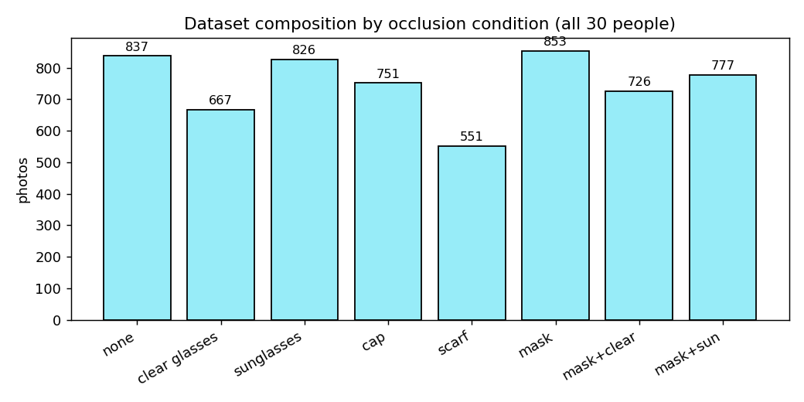
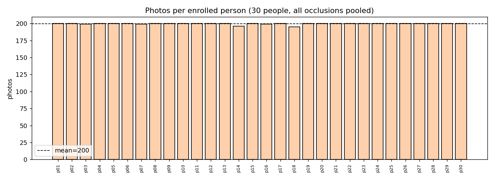

Coverage is not perfectly uniform: two people are missing one occlusion condition each (equipment/scheduling gaps during capture — e.g. no `cap` photos for one person), and `scarf` has noticeably fewer photos across the board (only 24/30 people have it) because it was added to the protocol slightly later. This has a direct, visible consequence in the results (§6.3): `scarf`'s per-occlusion accuracy is measured on a smaller, less diverse sample than every other condition.

### 2.2 Detection and alignment pipeline

Every raw photo goes through the same two-stage pipeline before it ever reaches ArcFace:

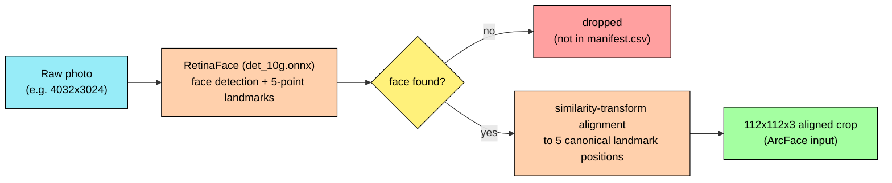

`manifest.csv` records, per crop: `person_id`, `occlusion`, `lighting`, the RetinaFace `det_score` (detector confidence, used later for benchmark selection — §3.3), and `bbox_area_frac` (how much of the frame the detected face occupies). The detector's own confidence is not uniformly high across the dataset — occluded faces are systematically harder to detect, not just harder to recognize:

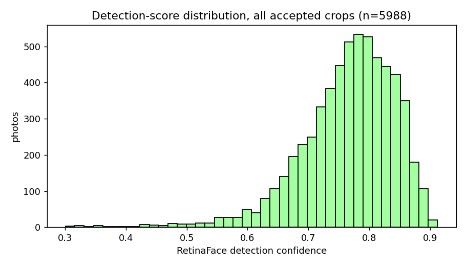

### 2.3 Sample data: every occlusion, several people

Raw photos (pre-detection) for three representative people, one column per occlusion condition:

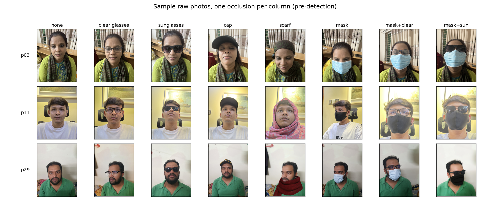

The same photos after RetinaFace detection + alignment — this 112x112 crop is exactly what ArcFace receives as input, nothing else:

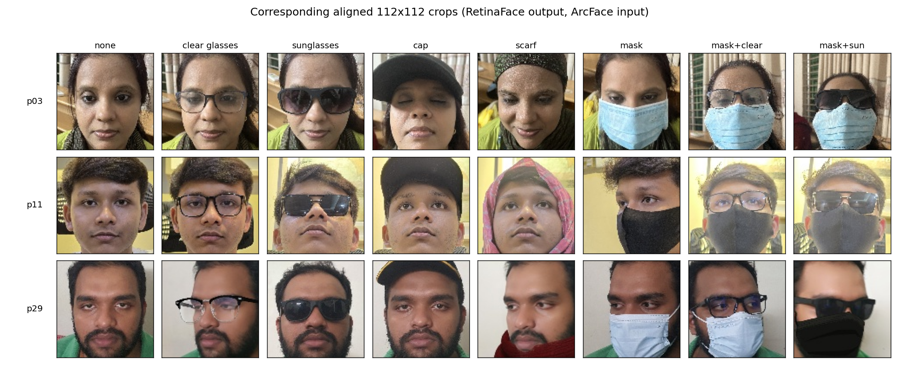

### 2.4 Where RetinaFace already fails — raw photos with no detected face

Before ArcFace ever sees a photo, RetinaFace has to find and align a face in it (§2.2). This step is not perfectly reliable: **12 of the 6,000 raw photos (0.2%)** contain no face RetinaFace could detect at all, and were silently dropped — they never appear in `manifest.csv`, have no crop, and are never seen by ArcFace or by any of the E0/E1/E2 experiments. Found by diffing every raw file in `processed_data/` against `manifest.csv`'s `image_path` column (`scripts/24_report_figures.py::fig_retinaface_failures`), these are all 12, not a sample:

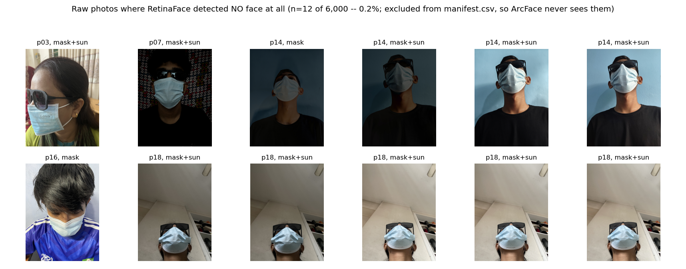

Two clear, non-overlapping causes account for all 12:
- **`p18`'s five photos (bottom row, rightmost five)** are all shot from a steep downward angle — the phone camera pointed down at a face tilted forward, chin-to-chest, looking at the floor. RetinaFace's landmark model expects roughly frontal-to-moderate head poses; this extreme pitch angle, combined with `mask_sunglass` already hiding the mouth and eyes, leaves essentially no usable frontal facial geometry.
- **The other 7 photos (`p03`, `p07`, `p14`×4, `p16`)** combine `mask` or `mask_sunglass` occlusion with underexposed/low-light conditions — several are near-silhouettes with almost no visible facial detail at all.

Every one of these 12 failures occurs under `mask`, `mask_sunglass`, or extreme pose+lighting — never under a milder occlusion condition. This is a meaningful data point on its own: **the hardest occlusion condition for recognition (§6.3's `mask_sunglass`, 35.6% E0 accuracy) is also the condition RetinaFace itself struggles to even detect a face in**, meaning the identification numbers in §6 already exclude the very worst real-world cases before ArcFace gets a chance — the true end-to-end failure rate under `mask_sunglass` conditions in the wild is somewhat higher than the 35–47% range in §6.3 suggests, since that range is conditioned on detection having already succeeded.

*(A separate, unrelated 2 of the 6,000 raw files are `.dng` RAW-format captures that were never converted to `.jpg` by the capture pipeline — a format-handling gap, not a detection failure — and are excluded from this count.)*

## 3. Data Splitting Strategy

### 3.1 Why person-disjoint, not image-level

Generalization to *unseen people* can only be measured honestly if no photo of a test person is ever visible during training in any form. The dataset contains near-duplicate/burst photos (multiple frames from the same phone-camera capture, sharing a `group_id`) — an image-level split (random 60/20/20 over individual photos, ignoring identity) can and does place near-identical frames of the same burst on both sides of the split, which is not a meaningful test of generalization to a new person. The split used throughout this project is therefore always by **identity**, not image: if a person is a training person, *all* of their photos (every occlusion, every burst) go to training; if they are a test person, *none* of their photos are ever seen during fine-tuning. This makes any such leakage structurally impossible, at the cost of a harder, more honest evaluation.

### 3.2 6-fold person-disjoint rotation

All 30 people are shuffled once with a fixed seed (42) and cut into 6 blocks of 5. Fold *k* uses block *k* as the test set and block *(k+1) mod 6* as validation; the remaining 20 people (4 blocks) are the training set. Rotating over all 6 folds means every person is a test person in exactly one fold and a validation person in exactly one fold — full coverage with no person ever evaluated twice in the same role.

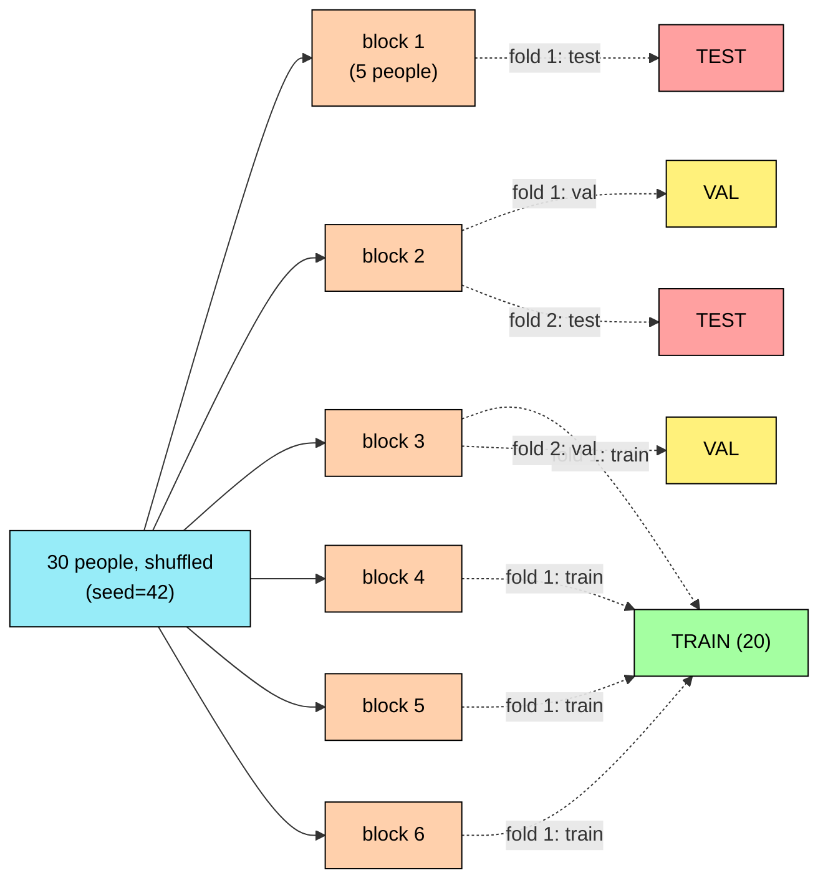

*(fold 3–6 follow the identical rotation pattern: test = block k, val = block (k mod 6)+1, train = the other four blocks — omitted above for space; the actual assignment for all 30 people x 6 folds is below.)*

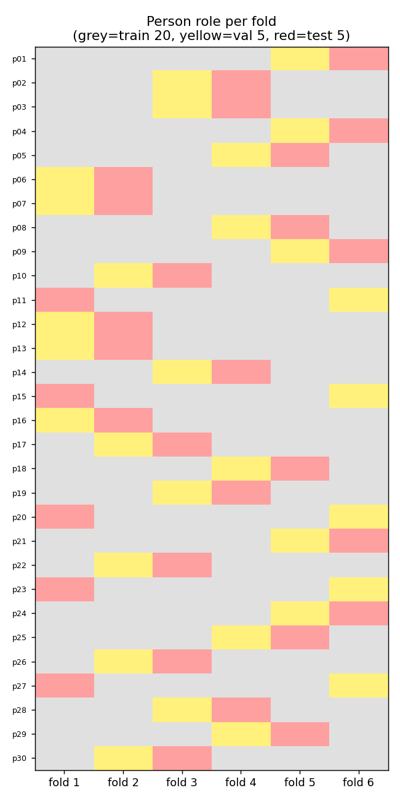

Fold 1 is, by construction (same seed, same shuffle order), identical to an earlier single-fold-only version of this experiment — it is exactly reproduced here as one of the six folds rather than superseded.

### 3.3 Benchmark embedding selection

Each of the 30 people needs exactly one **benchmark** photo — the single embedding every query photo is compared against for that identity. This benchmark must be unoccluded and clean, so it is always chosen from that person's `none` (no occlusion) photos, picking the one with the **highest RetinaFace detection confidence** (a proxy for sharpest, most frontal, best-lit capture — see §2.2's det-score discussion):

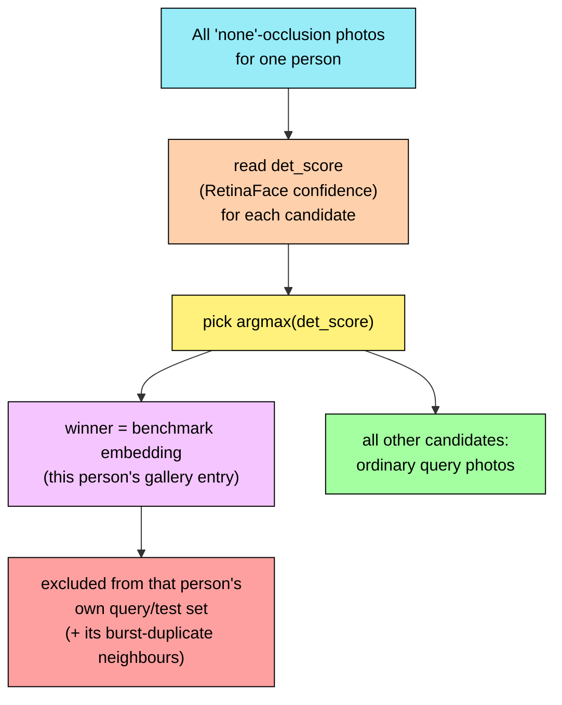

A real example (p03's 6 highest-scoring `none` candidates; the winner is outlined and used as the benchmark, the rest remain ordinary query photos):

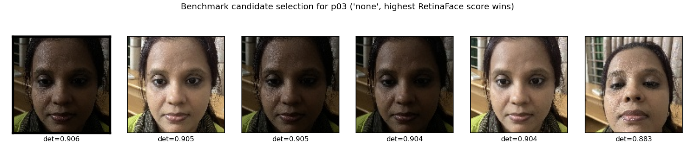

The benchmark photo itself, and every near-duplicate burst frame of it, is excluded from that person's query set (`excluded` in `metadata/e1e2_person_folds.json`) — otherwise a query could trivially match against a near-copy of itself. This selection is **fold-independent**: the same 30 benchmarks (`runs/e1e2/person_benchmarks.npz`) are reused across all 6 folds, since which photo is "cleanest" for a person doesn't depend on which fold is currently testing them.

### 3.4 Acceptance / UNKNOWN threshold

A prediction counts as correct only if **both**: the nearest benchmark (by cosine similarity, out of all 30) is the query's own person, **and** that cosine similarity is **≥ 0.3**. Below 0.3, the answer is REJECTED regardless of whether the nearest match happened to be right — mirroring a real enrollment system's UNKNOWN cutoff, where a low-confidence match should never be acted on even if it happens to be correct. Since every val/test person genuinely has a matching benchmark in the 30-person gallery (there are no true strangers in this dataset), a rejection is always a *miss* on a real person, not a correct rejection of an impostor.

## 4. Model Architectures

Both models are the frozen `buffalo_l` ONNX models shipped by InsightFace, loaded once via `onnx2torch.convert()` and verified numerically identical to the ONNX runtime output (cosine similarity ≥ 0.999) before any fine-tuning — see §5.1. All layer names, shapes and counts below were extracted directly from the ONNX graphs in `latest/models/` (not textbook approximations).

### 4.1 ArcFace recognizer — `w600k_r50.onnx` (IResNet-50)

**Input:** `[N, 3, 112, 112]` RGB, normalized `(pixel - 127.5) / 127.5` to `[-1, 1]`. **Output:** `[N, 512]` — a single L2-normalizable embedding vector per face. **43,590,976 parameters** total, organized as a stem followed by 4 residual stages (`[3, 4, 14, 3]` blocks, IResNet-50) and an embedding head (final BatchNorm -> flatten -> fully-connected -> final BatchNorm).

The diagram below shows only what matters for this report: the overall shape of the network, and exactly which layers E1/E2 unfreeze (verified directly against the ONNX graph's tensor names and each checkpoint's own recorded `unfrozen_names`, not just source-code convention):

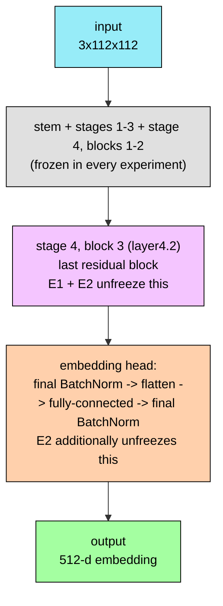

**E1** unfreezes only `layer4.2` (the last residual block, right before the embedding head): ONNX tensors `BatchNormalization_121`, `Conv_122`, `Conv_124` — 4,720,640 trainable parameters. **E2** unfreezes the same block **plus** the entire embedding head: `BatchNormalization_126`, `Gemm_128` (the fully-connected projection), `BatchNormalization_129` — 17,568,256 trainable parameters. Everything else in the network (the stem and the first ~21 residual blocks) is frozen in both experiments.

### 4.2 RetinaFace-family detector — `det_10g.onnx` (SCRFD)

Used for detection + 5-point landmark alignment only (§2.2) — it is never fine-tuned and plays no role in E0/E1/E2's identification accuracy, since training/evaluation there operates on already-cropped `manifest.csv` photos. It is still required for the live demo pipeline (a new photo has no pre-existing crop), which is why it ships in `latest/models/`.

**Input:** `[1, 3, H, W]`, dynamic resolution (typically 640x640 at inference). **Output:** 9 tensors — one classification-score, one bbox-regression and one 5-point-landmark tensor **per FPN level**, at 3 levels (strides 8 / 16 / 32, 2 anchors/location):

| FPN level | Stride | Feature map (640 input) | Anchors | Score shape | Bbox shape | Landmark shape |
|---|---|---|---|---|---|---|
| P3 | 8 | 80x80 | 2/loc | `[12800, 1]` | `[12800, 4]` | `[12800, 10]` |
| P4 | 16 | 40x40 | 2/loc | `[3200, 1]` | `[3200, 4]` | `[3200, 10]` |
| P5 | 32 | 20x20 | 2/loc | `[800, 1]` | `[800, 4]` | `[800, 10]` |

**4,225,835 parameters.** 158 ONNX nodes: 58 Conv, 36 ReLU, 16 Add, 3 AveragePool (channel-attention/SE-style blocks), 3 Sigmoid (score activations), 2 Resize (top-down FPN upsampling), 1 MaxPool.

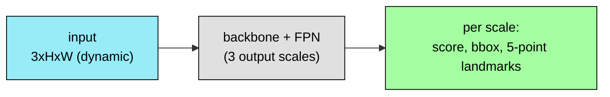

This is the **SCRFD** architecture (Sample and Computation Redistribution for Efficient Face Detection): a lightweight backbone feeding a 3-level feature-pyramid neck, predicting a face score, a bounding box, and 5 facial landmarks (used for the similarity-transform alignment in §2.2) at each of the 3 output scales.

## 5. Experiments: E0 / E1 / E2

### 5.1 Common protocol

All three experiments share the exact same data flow, loss definition and evaluation rule; they differ only in *which backbone tensors have `requires_grad=True`* (§4.1's `UNFREEZE_PREFIXES`). Before any training, `19_e1e2_person_finetune.py` converts the frozen ONNX graph with `onnx2torch` and checks it against `onnxruntime`'s own output on random input (`cosine similarity >= 0.999` required) — this guards against the conversion silently producing a numerically different model.

**Locked classification head.** Rather than a trainable classifier, the "head" is the 20 training-people's own benchmark embeddings (§3.3), L2-normalized and stored as a non-trainable buffer (`register_buffer`, never touched by the optimizer). Every training photo is pulled toward *its own person's fixed benchmark direction* and pushed away from the other 19 — this is why fine-tuning cannot simply memorize an arbitrary softmax head; the targets themselves are frozen, real embeddings.

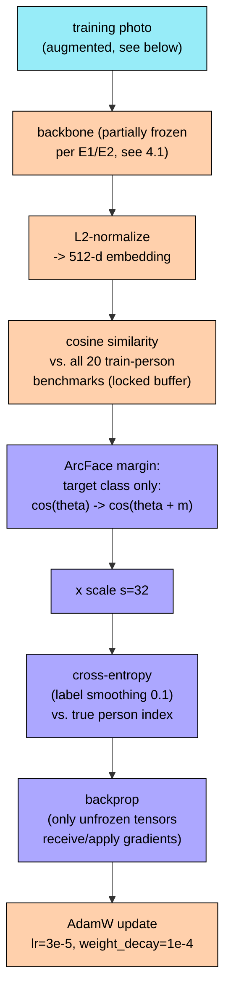

**ArcFace additive angular margin.** For the target class only, the raw cosine `cos(theta)` is replaced by `cos(theta + m)` before scaling — this pushes the true class's decision boundary further away in angle space, forcing embeddings of the same person to cluster tighter than plain softmax would. `m` is **not constant from epoch 1**: it ramps in to avoid destabilizing the (mostly frozen) backbone early in training —

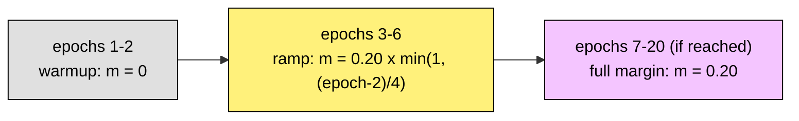

**Hyperparameters** (identical for E1 and E2; E0 trains nothing):

| Hyperparameter | Value |
|---|---|
| Optimizer | AdamW |
| Learning rate | 3e-5 |
| Weight decay | 1e-4 |
| LR schedule | Cosine annealing, `T_max` = 20 epochs |
| Batch size (train / eval) | 32 / 64 |
| Max epochs | 20 |
| Early-stop patience | 5 epochs with no improvement |
| ArcFace margin `m` (full) | 0.20 |
| Margin warmup / ramp | 2 epochs at 0, then linear ramp over 4 epochs |
| Loss scale `s` | 32.0 |
| Label smoothing | 0.1 |
| Random seed | 42 (data shuffle, fold construction, augmentation, weight init all seeded — every run is exactly reproducible) |

**BatchNorm stays frozen regardless of unfreeze scope.** `EmbeddingModel.train()` is overridden to always force `self.backbone.eval()` — so even for E1/E2's unfrozen BatchNorm *affine* parameters (`weight`/`bias`), the *running statistics* (`running_mean`/`running_var`) never update from training-batch statistics. Only the affine scale/shift of an unfrozen BN layer is ever learned; the normalization itself stays anchored to the original ImageNet/MS1M-scale pretraining statistics. This is a deliberate stability choice for a fine-tuning run this small (20 people, a few thousand photos) — re-estimating BN statistics from such a small, occlusion-skewed batch distribution would risk destabilizing every downstream layer, not just the unfrozen ones.

**Light augmentation** is applied per-batch, independently per image, at training time only (`light_augment()`): horizontal flip (p=0.5), a light downscale-then-upscale blur simulating a lower-resolution capture (p=0.3), Gaussian blur (p=0.15), Gaussian pixel noise (p=0.2), JPEG re-encoding at a random quality 50–95 (p=0.3), and brightness/contrast jitter (p=0.2). This is intentionally mild — the goal is robustness to capture-quality variation, not synthetic occlusion (the dataset already has 8 real occlusion conditions).

**Model selection and early stopping.** After every epoch, the model is scored on that fold's validation people (against the *full* 30-person gallery, at the 0.3 acceptance threshold). The key `(val_acc, val_gap)` — accepted-and-correct rate, ties broken by mean benchmark gap — is compared to the current best with a **strict `>`, no tolerance**: an epoch must exceed the previous best, not merely tie it, to become the new checkpoint. If 5 consecutive epochs fail to improve on the best, training stops early. Because epoch 0 (the untrained backbone) is itself scored and seeded as the initial "best," **an experiment that never finds a better epoch keeps the untrained checkpoint** — this is exactly what happens to E2 in 3 of the 6 folds (§6.2).

### 5.2 E0 — untrained baseline

No parameters unfrozen (`UNFREEZE_PREFIXES["e0"] = ()`), run with `--epochs 0`: the training loop never executes, and `score()` is called once against the frozen pretrained backbone. This is not a placebo condition — it is the actual `w600k_r50.onnx` weights, unmodified, evaluated with the same 0.3-threshold protocol as E1/E2, and is the baseline every comparison in §6 is measured against.

### 5.3 E1 — last residual block only

**Unfrozen:** `layer4.2` (stage 4, block 3) — `BatchNormalization_121` (`bn1`), `Conv_122` (`conv1`), `Conv_124` (`conv2`). **4,720,640 trainable parameters** (all of stage 4's channel width, 512, concentrated in one block's two 3x3 convolutions plus one BatchNorm's affine parameters).

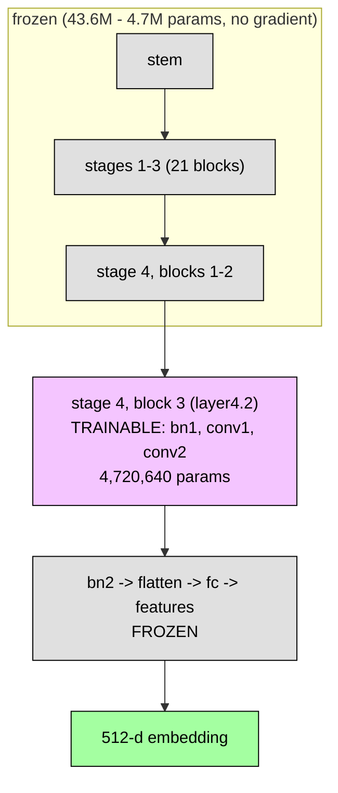

Gradients from the ArcFace loss backpropagate through the *entire* frozen network (the chain rule still runs through `bn2`, `fc`, and `features` to reach `layer4.2`), but `opt.step()` only ever updates `layer4.2`'s 3 tensors — everything upstream and downstream of that block is computed in the forward/backward pass but never modified. Across all 6 folds, E1's best epoch was consistently **epoch 5** (5 of 6 folds) or epoch 8 (fold 4) — see the full curves in the epoch-curve appendix (§8) — meaning early stopping's patience of 5 was rarely fully exhausted; the improvement over the untrained checkpoint typically appears quickly and plateaus.

### 5.4 E2 — last residual block + embedding head

**Unfrozen:** everything E1 unfreezes, **plus** `BatchNormalization_126` (`bn2`), `Gemm_128` (`fc`), `BatchNormalization_129` (`features`) — the entire post-backbone embedding projection. **17,568,256 trainable parameters**, dominated by `fc.weight`'s `[512, 25088]` matrix (12.85M parameters on its own — nearly three-quarters of E2's trainable budget).

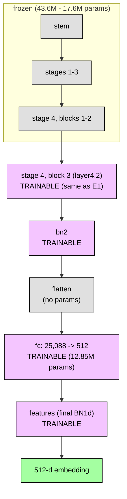

This is a materially larger and more direct change: the embedding head decides the final 512-d coordinate system the loss is computed in, so retraining it can reshape the entire embedding space, not just refine late-stage features. With 3.7x more trainable parameters than E1 on a training set of only 20 people, E2 is also considerably more prone to overfitting the training identities in a way that does not transfer — which is exactly the pattern seen in the results: in 3 of 6 folds (folds 3, 4, 5), **no epoch of E2 training ever beat the untrained epoch-0 checkpoint on validation**, so model selection fell back to the untrained backbone (best_epoch=0) and E2's saved checkpoint for those folds is, in effect, identical to E0's.

## 6. Results

All numbers below are pooled from **exact per-fold counts**, not averaged percentages, so fold-size differences don't bias the total (n = 5,818 query photos across all 6 folds, every one of the 30 people tested exactly once).

### 6.1 Pooled accuracy

| | Accepted & correct | Rejected, correct-but-<0.3 | Rejected, wrong-and-<0.3 | Misidentified (wrong, ≥0.3) | Folds where training beat E0 |
|---|---|---|---|---|---|
| **E0** (untrained) | 84.98% | 12.50% | 2.53% | 0.00% | — |
| **E1** | **86.18%** | 8.47% | 5.12% | 0.22% | **6 / 6** |
| **E2** | 84.72% | 7.24% | 4.73% | 3.32% | 3 / 6 (folds 3, 4, 5 fell back to E0) |

All four columns sum to exactly n=5,818 (100%) per row — computed from the per-fold `test_correct_n` / `test_rejected_correct_n` / `test_misidentified_accepted_n` exact integer counts saved in each fold's `*_person_results.json`, pooled across all 6 folds, with the residual ("wrong top match, also below threshold") derived as `n - correct - rejected_correct - misidentified`. Recomputing the same breakdown independently from `*_predictions.csv` (§8, run on CPU here rather than the original training run's GPU) reproduces every number to within one image out of 5,818 — the sole discrepancy is one query whose cosine score lands within floating-point noise of the 0.3 cutoff itself, flipping "accepted" vs "rejected" between the two hardware backends. The table above uses the original GPU-run numbers throughout, matching [`report.md`](report.md) and [`confusion_matrices.md`](confusion_matrices.md).


**E1 is the only configuration that reliably beats doing nothing.** It improved on E0 in every one of the 6 folds, cut the correct-but-rejected rate by nearly a third, and stayed almost entirely free of confidently wrong answers (0.22% pooled). **E2 is a wash with E0 at best** — 0.26pp worse pooled accuracy, and in half the folds its own model-selection rule reverted to the untrained checkpoint outright because no epoch of training ever beat validation epoch 0 (§5.4). Where E2 *did* "win," it did so partly by trading rejections for confidently wrong answers (3.32% pooled misidentification vs. E1's 0.22%, E0's 0%) — a materially worse failure mode for an identification system, since a confident wrong answer is acted on, while a rejection is not.

**What E0's mistakes actually look like.** The table's "misidentified" column for E0 is exactly 0.00% — the untrained backbone never confidently picks the wrong person at the 0.3 threshold. These are real examples pulled from `runs/e1e2/analysis/e0_predictions.csv` (every test-fold query's true identity, top match, and cosine score — §8), not staged:

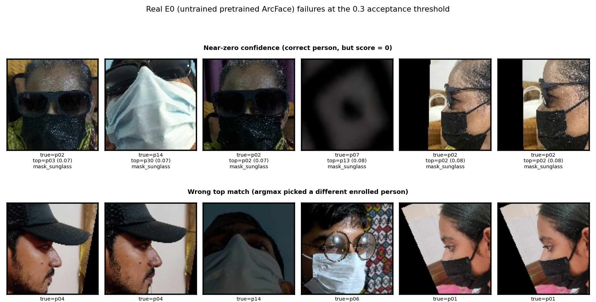

- **Top row — near-zero confidence, correct person.** The nearest benchmark is still the right person, but the score is so low (≈0.07–0.08, far under 0.3) that the system correctly rejects it as UNKNOWN. All six examples are `mask_sunglass` — the same double-occlusion condition responsible for both §2.4's detection failures and §6.3's worst per-occlusion accuracy.
- **Bottom row — wrong top match, but still rejected.** The *argmax* pick is a different enrolled person, which sounds worse — but the scores (0.24–0.26) are still below 0.3, so these are rejected, not misidentifications, matching the 0.00% figure above. The pretrained backbone's mistakes are essentially all low-confidence, not confidently-wrong — exactly the failure mode the 0.3 acceptance threshold is designed to catch and neutralize.

### 6.2 Per-fold detail

| Fold | Test people | E0 acc | E1 acc (best epoch) | E2 acc (best epoch) |
|---|---|---|---|---|
| 1 | p11,p15,p20,p23,p27 | 84.39% | 86.76% (5) | 85.01% (5) |
| 2 | p06,p07,p12,p13,p16 | 80.71% | 81.02% (5) | 81.02% (6) |
| 3 | p10,p17,p22,p26,p30 | 88.60% | 89.02% (5) | 88.60% (**0**) |
| 4 | p02,p03,p14,p19,p28 | 80.47% | 82.01% (8) | 80.47% (**0**) |
| 5 | p05,p08,p18,p25,p29 | 90.83% | 92.40% (5) | 90.83% (**0**) |
| 6 | p01,p04,p09,p21,p24 | 85.02% | 86.06% (5) | 82.52% (6) |

`(0)` means model selection never found an epoch better than the untrained backbone — that fold's E2 checkpoint is, for evaluation purposes, the same frozen network as E0. Full epoch-by-epoch curves for every fold x experiment (loss, train accuracy, val accuracy, val gap, and which epoch was kept) are in [`epoch_curves.md`](epoch_curves.md):


### 6.3 Per-occlusion breakdown

| Occlusion | n | E0 | E1 | E2 |
|---|---|---|---|---|
| none | 667 | 100% | 99.4% | 99.6% |
| clearglass | 667 | 100% | 99.0% | 98.7% |
| sunglass | 826 | 98.5% | 99.2% | 97.2% |
| scarf | 551 | 97.3% | 94.9% | 96.0% |
| cap | 751 | 95.5% | 95.2% | 94.3% |
| mask | 853 | 90.2% | 89.9% | 88.0% |
| mask_clearglass | 726 | 68.5% | 68.9% | 66.7% |
| **mask_sunglass** | 777 | 35.6% | **47.2%** | 42.7% |


Fine-tuning barely moves, or slightly hurts, the occlusions E0 already handles well (`none` through `mask`). **The entire benefit of E1 over E0 is concentrated in `mask_sunglass`** (35.6% → 47.2%, by far the largest swing in the table) — the one condition that occludes both the lower face (mask) and the eye region (sunglasses) simultaneously, leaving the pretrained model with almost nothing recognizable. `mask_clearglass` (which occludes the mouth/nose but leaves the eyes visible through clear lenses) is roughly flat — evidently there is enough signal left in that condition that fine-tuning has little room to help. E2 captures part of the same `mask_sunglass` gain (35.6% → 42.7%) but less of it than E1, while giving up ground on nearly every other condition.

**scarf's smaller, less diverse sample (§2.1 — only 24/30 people) is worth keeping in mind here**: its per-occlusion numbers rest on a narrower base than the other 7 conditions, so the apparent 2.4pp drop for E1 (97.3% → 94.9%) is measured with less statistical weight than, say, `mask` or `sunglass`.

### 6.4 Learning curve: training loss and validation loss

19_e1e2_person_finetune.py (§5.1) never computed a validation loss — only validation accepted-correct rate, since that is what model selection actually uses (val/test people are open-set relative to the 20-class training head, so a directly comparable loss wasn't part of the original design). To get a genuine loss-based learning curve, `scripts/25_e1e2_learning_curve.py` (new) re-runs training for all 6 folds x {E1, E2} on the 3090 box with the identical seed and recipe, adding one cheap extra computation: a validation cross-entropy loss (over the full 30-person gallery, no margin, no label smoothing) from the same cosine-similarity matrix `score()` already computes for accuracy — no extra forward passes. Every `val_acc`/`best_epoch`/test-accuracy number reproduced bit-for-bit identically to the original `runs/e1e2/folds/` results (verified programmatically); only `val_loss` is new.

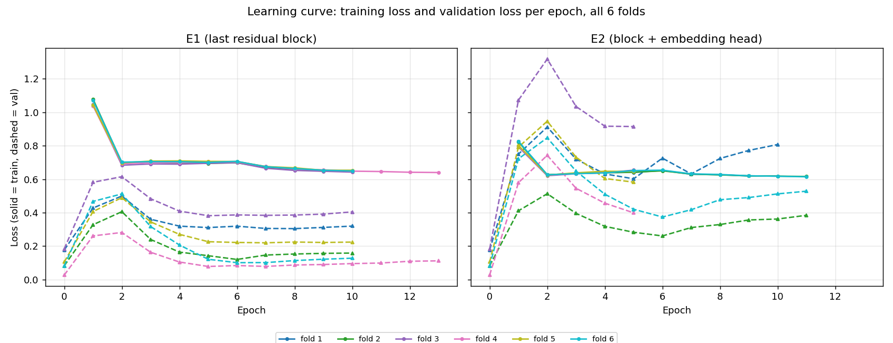

Solid = training loss, dashed = validation loss, one colour per fold, epoch on the x-axis. Both experiments share the same opening move: epoch 0 (untrained) starts at a low validation loss — the frozen pretrained embeddings are already well-separated — and training loss spikes hard at epoch 1 as the first gradient updates perturb that well-calibrated state, then drops sharply by epoch 2 as the small unfrozen slice adapts.

**From there E1 and E2 diverge.** E1's validation loss, after its own early spike, recovers and settles into a fairly tight band across all 6 folds by epoch 5–6 — consistent with its best epoch reliably landing at epoch 5 in 5 of 6 folds (§5.3). E2's validation loss is both **higher and far less consistent across folds**: fold 3 (purple) peaks above 1.3 and never comes back down below ~0.9; fold 1 (blue) recovers initially but then **climbs back up from epoch 6 onward, in lock-step with its own rising training loss** — a genuine divergence/overfitting signature, not just noise. This is the loss-level explanation for two things already established from the accuracy side: why E2's model selection falls back to the untrained checkpoint in 3 of 6 folds (§5.4, §6.2) — validation loss for those folds never meaningfully improves either — and why E2 is the less reliable configuration overall (§7), even in the folds where it does end up "winning" on accuracy.

### 6.5 Per-person confusion matrices and macro metrics

Full 30-person confusion matrices (each with an extra REJECT column — a query below the 0.3 threshold counts against that person's recall but never against anyone else's precision), per-person precision/recall/F1, and the same broken down per-occlusion, are in [`confusion_matrices.md`](confusion_matrices.md). Headline macro metrics:

| Experiment | Accuracy | Macro precision | Macro recall | Macro F1 |
|---|---|---|---|---|
| E0 | 84.98% | 100.00% | 85.12% | 91.67% |
| E1 | 86.18% | 99.72% | 86.33% | 92.15% |
| E2 | 84.72% | 96.43% | 84.87% | 89.85% |


Macro precision stays near 100% for all three configurations precisely because misidentification is rare (§6.1) — almost all of the gap between accuracy and recall in every confusion matrix is the REJECT column, not a wrong-person column. E2's visibly lower macro precision (96.43% vs. E0's 100.00%) is the confusion-matrix-level signature of the same 3.32% pooled misidentification rate from §6.1.

## 7. Discussion & Conclusion

**Ranking: E1 > E0 > E2.** Of the two fine-tuning scopes tested, only the narrower one (last residual block only) reliably improves generalization to unseen people, and only by a modest but consistent margin (+1.2pp pooled, 6/6 folds). The wider scope (E1's scope plus the embedding head) is not worth it under this evaluation: it wins in only half the folds, its "wins" partly come from converting rejections into confident mistakes rather than clean gains, and its worse-case behavior (reverting to the untrained model when nothing improves) still occurs 50% of the time.

The mechanism is consistent with the architecture: E2 has 3.7x more trainable parameters (17.57M vs. 4.72M) drawn from only 20 training identities' photos, concentrated overwhelmingly in one very large matrix (`fc.weight`, 12.85M of E2's 17.57M trainable parameters) that directly reshapes the entire 512-d embedding coordinate system rather than refining late-stage features within it. That is a much higher-capacity, more disruptive change to fit on a 20-person training set, and the person-disjoint evaluation (§3.1) is specifically designed to expose exactly this kind of failure to generalize — which is what it does.

The benefit that does exist is narrow and specific: **essentially all of E1's gain over doing nothing is concentrated in the single hardest occlusion condition, `mask_sunglass`** (double occlusion, both lower face and eyes covered), where the untrained backbone is barely above chance-adjacent territory (35.6%) to begin with. For every occlusion condition milder than that, the untrained pretrained ArcFace backbone is already at or near its ceiling, and fine-tuning has no meaningful room to help — and some small room to hurt.

**Practical takeaway for this enrollment scenario:** if any fine-tuning is done at all, restrict it to the last residual block only, and expect the benefit to be concentrated in the most severely occluded condition, not a uniform improvement across the board. For any occlusion condition milder than mask+sunglasses, the frozen pretrained backbone at a 0.3 acceptance threshold is already close to its practical ceiling.

## 8. Reproduction & File Index

Every run is seeded (42) and reproduces identically (fold construction, augmentation, weight init). Full pipeline, in order:

```bash
# 1. Build the 6-fold rotation + one-best benchmarks (fold-independent)
python scripts/20_e1e2_person_folds.py

# 2. Train/evaluate E0/E1/E2 for every fold (run from the GPU box, /home/tahmid/ layout)
for fold in 1 2 3 4 5 6; do
  for exp in e0 e1 e2; do
    epochs_flag="--epochs 20"; [ "$exp" = "e0" ] && epochs_flag="--epochs 0"
    python scripts/19_e1e2_person_finetune.py --exp $exp $epochs_flag \
      --setup metadata/e1e2_person_folds.json --fold $fold \
      --out-dir runs/e1e2/folds --accept-threshold 0.3
  done
done

# 3. Rebuild confusion matrices / metrics from the saved checkpoints (no retraining; CPU is fine)
python scripts/21_e1e2_confusion.py --exp e0
python scripts/21_e1e2_confusion.py --exp e1
python scripts/21_e1e2_confusion.py --exp e2

# 4. Per-image prediction dump (source of this report's failure gallery + §6.1's rejected/misidentified split)
python scripts/23_dump_predictions.py --exp e0
python scripts/23_dump_predictions.py --exp e1
python scripts/23_dump_predictions.py --exp e2

# 5. Learning curve (train + val loss per epoch): re-runs E1/E2 training with val_loss added,
#    same seed -- reproduces runs/e1e2/folds/ bit-for-bit, adding only val_loss (run from the GPU box)
for fold in 1 2 3 4 5 6; do
  for exp in e1 e2; do
    python scripts/25_e1e2_learning_curve.py --exp $exp --epochs 20 \
      --setup metadata/e1e2_person_folds.json --fold $fold \
      --out-dir runs/e1e2/learning_curve --accept-threshold 0.3
  done
done

# 6. All figures in docs/plots/ used by this report and by confusion_matrices.md / epoch_curves.md
python scripts/22_e1e2_plots.py
python scripts/24_report_figures.py
```

| Path | Contents |
|---|---|
| `metadata/manifest.csv` | Every crop: person, occlusion, lighting, detection score, group id |
| `metadata/e1e2_person_folds.json` | All 6 folds: train/val/test people, each person's benchmark photo, query exclusions |
| `runs/e1e2/person_benchmarks.npz` | The 30 one-best benchmark embeddings (shared by all folds) |
| `runs/e1e2/folds/fold{1-6}/{e0,e1,e2}_person_model.pt` | Backbone checkpoints, best epoch (18 total, ~3GB) |
| `runs/e1e2/folds/fold{1-6}/{e0,e1,e2}_person_model_history.json` | Per-epoch training/validation curve per fold |
| `runs/e1e2/folds/fold{1-6}/{e0,e1,e2}_person_results.json` | Test metrics per fold: exact counts + percentages |
| `runs/e1e2/learning_curve/fold{1-6}/{e1,e2}_person_model_history.json` | Same training re-run with `val_loss` added (source of §6.4's learning curve) |
| `runs/e1e2/analysis/{e0,e1,e2}_metrics.json` | Pooled confusion-matrix-derived metrics (source of §6.5) |
| `runs/e1e2/analysis/{e0,e1,e2}_confusion_overall.csv` / `_<occlusion>.csv` | 30x31 (person + REJECT) confusion matrices |
| `runs/e1e2/analysis/{e0,e1,e2}_predictions.csv` | Per-image predictions: true/predicted person, score, outcome (source of §6.1's failure gallery and full breakdown) |
| `docs/plots/*.png` | Every figure embedded in this report |
| `models/w600k_r50.onnx`, `models/det_10g.onnx` | The two frozen models analyzed in §4 |
| `crops/` | All 5,988 aligned 112x112 face crops |

Companion documents: [`report.md`](report.md) (the original, shorter write-up this report supersedes), [`confusion_matrices.md`](confusion_matrices.md) (full per-person tables), [`epoch_curves.md`](epoch_curves.md) (full per-epoch tables, every fold x experiment).
