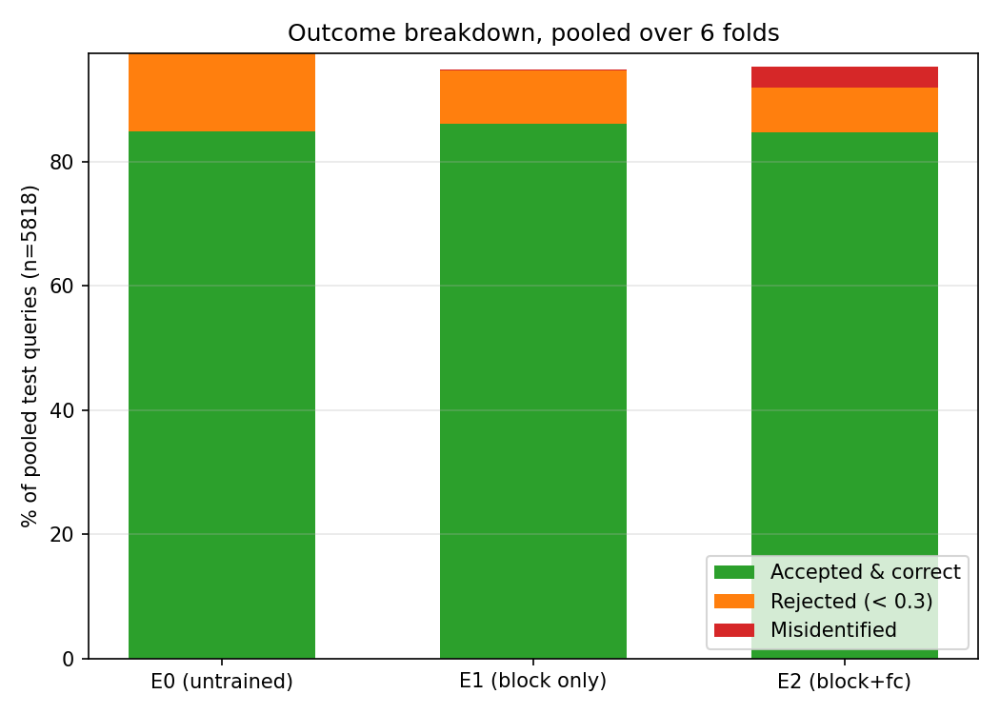
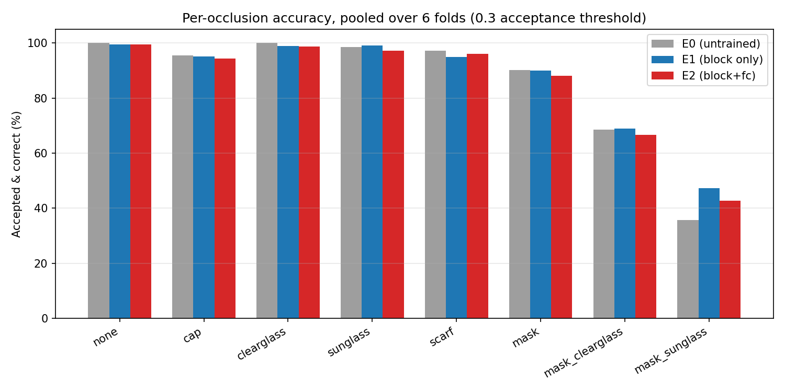

# Report: E0/E1/E2, 6-Fold Person-Disjoint Cross-Validation, 0.3 Acceptance Threshold (Final)

> For the full technical report — sample-data/crop galleries, data-splitting and benchmark-selection diagrams, verified block-level ArcFace/RetinaFace architectures, and complete E1/E2 training mechanics — see [`final_technical_report.md`](final_technical_report.md). This document remains the shorter results-focused write-up.

## 1. Objective

Test whether partially fine-tuning the ArcFace backbone helps or hurts recognition of people the model was **never trained on**, under a confidence cutoff on what counts as a correct identification — this time across **6 rotating folds**, so all 30 people are tested exactly once (not just 5), instead of relying on a single train/val/test split.

Three configurations, evaluated identically:

| Experiment | Backbone layers unfrozen | Trainable params |
|---|---|---|
| **E0** | none (untrained baseline) | 0 |
| **E1** | last residual block only | 4.72M |
| **E2** | last residual block + the embedding (fc) layer | 17.57M |

E1/E2 use the same recipe as before: ArcFace loss, class weights locked to a fixed benchmark embedding per person.

## 2. Data and folds

- All 30 people shuffled once (seed 42) and cut into 6 blocks of 5. Fold *k*: test = block *k*, val = block *(k+1) mod 6*, train = the other 20. Every person is a test person in exactly one fold and a val person in exactly one fold.
- Fold 1 is identical to the single-split experiment run earlier in this project (same test/val/train people) — that earlier single-fold result is now superseded by this 6-fold version and has been archived outside this folder.
- **Benchmark** (one per person, fold-independent): the clean (`none`), regular-light photo with the highest face-detector confidence score, from that person's own photos. Excluded from every person's query set: that photo and every near-duplicate/burst-neighbour of it, so nobody is tested against a copy of their own enrollment photo.
- **Training data** (E1/E2 only): every photo (all 8 occlusion conditions) of that fold's 20 train people.
- **Evaluation gallery**: every fold's val/test query photos are matched against **all 30** benchmarks, so a wrong answer could be any of the other 29 people, including the 20 the model trained on that fold.
- Because every split is by person, no image can ever appear in more than one role in the same fold — this rules out the near-duplicate/burst-photo leakage that affected an even earlier, image-level version of this experiment (also archived).

Produced by `scripts/20_e1e2_person_folds.py` → `metadata/e1e2_person_folds.json` + `runs/e1e2/person_benchmarks.npz`.

## 3. Acceptance threshold

A prediction counts as correct only if **both**: the nearest benchmark is the person's own, **and** that cosine similarity is **≥ 0.3**. Below 0.3 the answer is rejected (same rule as the live demo's UNKNOWN cutoff). Every val/test person has a real match in the 30-benchmark gallery — there are no strangers here — so a rejection is always a miss on someone real.

For E1/E2, model selection (which training epoch to keep) uses this same rule: the epoch with the highest **val accepted-correct rate** is kept, ties broken by mean benchmark gap, strict `>` comparison with no tolerance. E0 has no training (`--epochs 0`, nothing unfrozen) — its result is simply the frozen pretrained backbone evaluated at this threshold.

Produced by `scripts/19_e1e2_person_finetune.py --exp {e0,e1,e2} --setup metadata/e1e2_person_folds.json --fold N --accept-threshold 0.3`, run for every N in 1–6.

## 4. Results, pooled over all 6 folds (n = 5,818 query photos, all 30 people)

Pooled from exact per-fold correct/rejected/misidentified **counts** (not averaged percentages, so fold-size differences don't bias the total):

| | Accepted & correct | Rejected (correct but < 0.3) | Misidentified (wrong but ≥ 0.3) | Folds where training beat E0 |
|---|---|---|---|---|
| **E0** (untrained) | 84.98% | 12.50% | 0.00% | — |
| **E1** | **86.18%** | 8.47% | 0.22% | **6 / 6** |
| **E2** | 84.72% | 7.24% | 3.32% | 3 / 6 (folds 3, 4, 5 fell back to E0) |

**E1 is the only configuration that reliably beats doing nothing.** It improved on E0 in every fold, cut rejection by a third, and stayed almost free of confident mistakes. **E2 is a wash with E0 at best** (0.26pp worse pooled) — in 3 of 6 folds its own model selection reverted to the untrained checkpoint because no epoch of training beat it on validation; in the 3 folds where it did "win," it did so by trading rejections for confidently wrong answers (3.32% pooled vs. E1's 0.22%, E0's 0%).

### Per-fold detail

| Fold | Test people | E0 acc | E1 acc (best epoch) | E2 acc (best epoch) |
|---|---|---|---|---|
| 1 | p11,p15,p20,p23,p27 | 84.39% | 86.76% (5) | 85.01% (5) |
| 2 | p06,p07,p12,p13,p16 | 80.71% | 81.02% (5) | 81.02% (6) |
| 3 | p10,p17,p22,p26,p30 | 88.60% | 89.02% (5) | 88.60% (**0**) |
| 4 | p02,p03,p14,p19,p28 | 80.47% | 82.01% (8) | 80.47% (**0**) |
| 5 | p05,p08,p18,p25,p29 | 90.83% | 92.40% (5) | 90.83% (**0**) |
| 6 | p01,p04,p09,p21,p24 | 85.02% | 86.06% (5) | 82.52% (6) |

### Per-occlusion (pooled)

| Occlusion | n | E0 | E1 | E2 |
|---|---|---|---|---|
| none | 667 | 100% | 99.4% | 99.6% |
| clearglass | 667 | 100% | 99.0% | 98.7% |
| sunglass | 826 | 98.5% | 99.2% | 97.2% |
| scarf | 551 | 97.3% | 94.9% | 96.0% |
| cap | 751 | 95.5% | 95.2% | 94.3% |
| mask | 853 | 90.2% | 89.9% | 88.0% |
| mask_clearglass | 726 | 68.5% | 68.9% | 66.7% |
| **mask_sunglass** | 777 | 35.6% | **47.2%** | 42.7% |

**What the results mean:**
- Fine-tuning barely moves (E1) or slightly hurts (E2) the occlusions E0 already handled well (`none` through `mask`).
- The entire benefit of E1 over E0 is concentrated in `mask_sunglass` (35.6% → 47.2%, by far the largest swing in the table); `mask_clearglass` is roughly flat.
- E2 captures part of that same gain (35.6% → 42.7%) but less of it than E1, while giving up ground everywhere else and introducing the only non-trivial misidentification rate of the three.
- **Ranking: E1 > E0 > E2.** If fine-tuning at all, use the narrow scope (E1) — the wider scope (E2) is not worth it under this acceptance rule.

Full per-person and per-occlusion **confusion matrices**, with precision/recall/macro-F1/accuracy derived from them, are in [`confusion_matrices.md`](confusion_matrices.md) (the 30×31 person+REJECT matrices themselves are CSVs under `runs/e1e2/analysis/`; heatmap PNGs in `plots/`). The complete **epoch-by-epoch training curve** for every fold and experiment (superseding the "best epoch" column above) is in [`epoch_curves.md`](epoch_curves.md).

## 5. Contents of this folder

| Path | Contents |
|---|---|
| `docs/final_technical_report.md` | Full technical report: sample galleries, architecture diagrams, training mechanics, complete results |
| `docs/confusion_matrices.md` | Per-person and per-occlusion precision/recall/macro-F1/accuracy |
| `docs/epoch_curves.md` | Full epoch-by-epoch training/validation curve, every fold and experiment |
| `scripts/20_e1e2_person_folds.py` | Builds the 6-fold rotation and one-best benchmarks |
| `scripts/19_e1e2_person_finetune.py` | Trains/evaluates E0/E1/E2 (`--exp e0\|e1\|e2 --fold N --accept-threshold 0.3`) |
| `scripts/21_e1e2_confusion.py` | Builds the confusion matrices / metrics in `docs/confusion_matrices.md` from the saved checkpoints (no retraining) |
| `scripts/22_e1e2_plots.py` | Builds `docs/plots/*.png` from the CSVs/JSONs only — no model, no GPU, instant on any machine |
| `scripts/23_dump_predictions.py` | Per-image predictions (true/predicted person, score, outcome) for one `--exp`, from the saved checkpoints |
| `scripts/24_report_figures.py` | Sample/failure galleries, dataset distribution plots, fold-assignment grid, benchmark-selection example for `final_technical_report.md` |
| `scripts/25_e1e2_learning_curve.py` | Re-runs E1/E2 training (same seed, bit-for-bit identical results) with a validation loss added per epoch, for `final_technical_report.md`'s learning curve |
| `docs/plots/*.png` | Confusion-matrix heatmaps, per-occlusion accuracy, outcome breakdown, epoch curves, sample/failure galleries, dataset plots, learning curve |
| `metadata/e1e2_person_folds.json` | All 6 folds: train/val/test people, each person's benchmark photo, query exclusions |
| `runs/e1e2/person_benchmarks.npz` | The 30 one-best benchmark embeddings (shared by all folds) |
| `runs/e1e2/folds/fold{1-6}/{e0,e1,e2}_person_results.json` | Test metrics per fold: exact counts + percentages, per-occlusion, per-person |
| `runs/e1e2/folds/fold{1-6}/{e0,e1,e2}_person_model_history.json` | Per-epoch training/validation curve per fold (source of `epoch_curves.md`) |
| `runs/e1e2/folds/fold{1-6}/{e0,e1,e2}_person_model.pt` | Backbone checkpoints, best epoch (~166MB each, 18 total, ~3GB) |
| `runs/e1e2/learning_curve/fold{1-6}/{e1,e2}_person_model_history.json` | Same as above, re-run with `val_loss` added (source of `final_technical_report.md` §6.4) |
| `runs/e1e2/folds/all_folds_train.log` | Full console output, E1+E2, all 6 folds |
| `runs/e1e2/folds/all_folds_e0_train.log` | Full console output, E0, all 6 folds |
| `runs/e1e2/analysis/{e0,e1,e2}_metrics.json` | Source numbers for `confusion_matrices.md`, machine-readable |
| `runs/e1e2/analysis/{e0,e1,e2}_confusion_overall.csv` | 30×31 confusion matrix (true person × predicted person + REJECT), pooled over all 6 folds |
| `runs/e1e2/analysis/{e0,e1,e2}_confusion_<occlusion>.csv` | Same, restricted to that occlusion's query photos |
| `runs/e1e2/analysis/{e0,e1,e2}_predictions.csv` | Per-image predictions, source of the failure gallery and exact outcome breakdown in `final_technical_report.md` |

The 6 `e0_person_model.pt` files are byte-size-identical (174,446,716 bytes each) — expected, since E0 has nothing unfrozen and is the same frozen pretrained backbone regardless of fold.

**Also included, self-contained copies of shared project inputs** (this folder does not depend on anything outside it, except the untouched raw dataset in `../processed_data/` used only for `final_technical_report.md`'s raw-photo samples): `metadata/manifest.csv`, `crops/` (all 5,988 aligned crops), `models/w600k_r50.onnx` + `models/det_10g.onnx`.

**Superseded work, archived outside this folder** (`D:\ML train archive\`, not deleted):
- `latest_single_split_03\` — the earlier single-fold (test = 5 people only) version of this same 0.3-threshold experiment (E1/E2 only, no E0). Reproduced exactly by fold 1 above.

To reproduce from scratch: run `20_e1e2_person_folds.py`, then `19_e1e2_person_finetune.py` from the main project's `/home/tahmid/` layout, looping `--fold` 1 through 6 and `--exp` over `e0` (with `--epochs 0`), `e1`, `e2`, each with `--accept-threshold 0.3`. All runs are seeded (42) and reproduce identically. Run `21_e1e2_confusion.py --exp {e0,e1,e2}` afterwards to regenerate the confusion matrices from the saved checkpoints without retraining.
